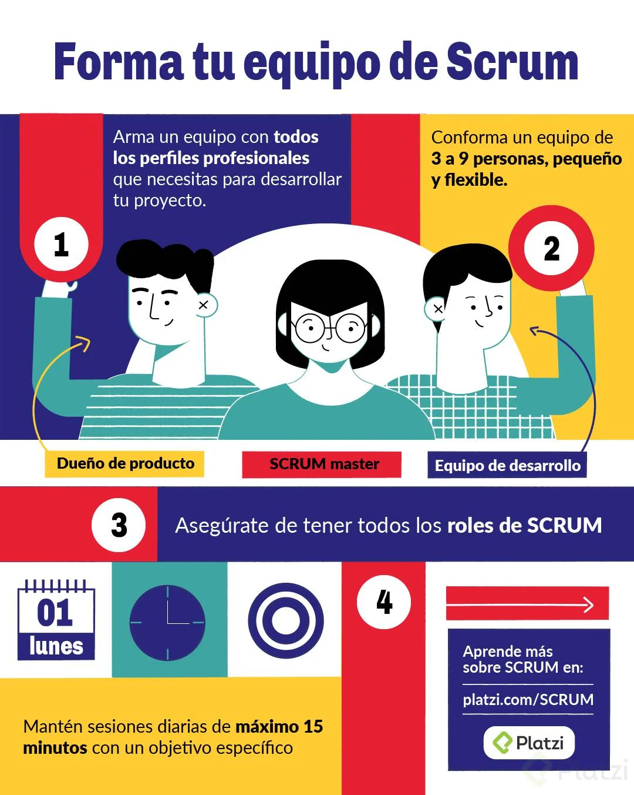
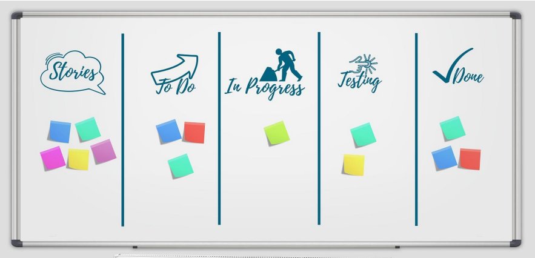
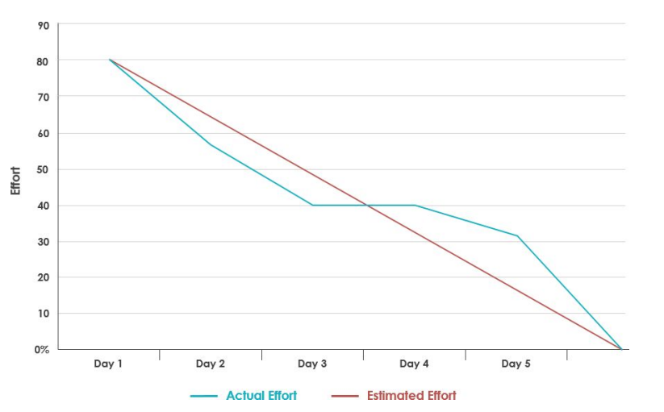
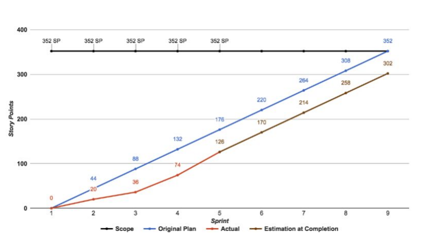
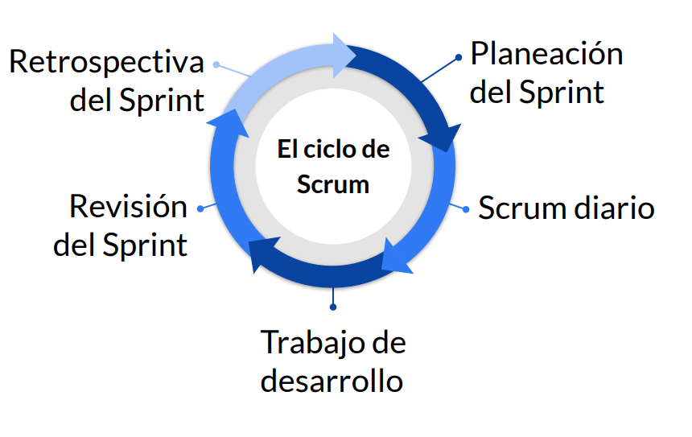

# Curso profesional de Scrum

- Valoración: ⭐⭐⭐⭐⭐
- Estado: Terminado
- Fecha de inicio: February 24, 2022 11:47 PM
- Fecha de termino: April 25, 2022
- Página: Platzi

# 1. Introducción

## 1.1. ¿Qué es una metodología ágil?

Antes de responder esta pregunta tenemos que saber que **Agile** es la habilidad para crear productos y responder al cambio, ademas **Agile** es un conjunto de marcos de trabajo y metodologías. Dentro de los marcos de trabajo pordemo mencionar a **scrum, canvas, XP (extreme programing)** y dentro de las metodologías podemos mencionar **P2P Programing y TDD (Test-Driven Development)**. **Agile** tambien se centre en las personas (clientes y/o trabajadores) y como estas trabajan y colaboran.

Agile se base en una mentalidad, que esta viene de un manifiesto agile y dieron la pauta para que nosotros podemos trabajar con ello.

> **Estamos descubriendo formas mejores de desarrollar software tanto por nuestra propia experiencia como ayudando a terceros.**
*Agile Manifesto*
> 

**Diferencias entre el desarrollo tradicional y el desarrollo agile.**

1. **Grupos de trabajo:** En grupos con desarrollo tradicional, generalmente se piensa que los grupos estan compuestos por 15 a 20 personas (grupos grandes) en un mismo proyecto, al tener esta cantidad de personas trabajando en un mismo proyecto podemos tener dificultades en saber quien está trabajando en que. **Agile** va a proponer crear equipos con a lo mas 5 personas y cada equipo va a tener **tiempos** cortos de desarrollo (2 semanas), estos micro tiempos se van a llamar **iteración**, con ella vamos a poder saber quien está trabajando en que y en que momento del proyecto.
2. **Manejo de requerimiento**: Tradicionalmente el desarrollador va donde el cliente y crear una lista enorme de requerimientos, esto puede llevar a errores en el futuro, **agile** nos dice que esta lista enorme de requerimientos sea acortada en **pequeñas listas de requerimientos** y talves no conoscamos el detalle de la lista grande de requerimientos, pero si la que debemos entregar en cada **iteración.**
3. **Generación del valor**: En desarrollo tradicional el programador terminaba la lista grande de requerimiento y la iba a mostrar al cliente y este te podria indicar nuevos cambios a todo el proyecto y esto te pondria meses de trabajo que no tenias contemplado, en cambio **Agile** nos dice que por cada **iteración** se tiene que ir con el cliente para mostrar avances y así este te indicará detalles minimos a corregir.

## 1.2. Aprendiendo los principios agiles.

Dentro de esta sección vamos a seguir viendo el manifiesto agil de desarrollo y de como este emanan los **12 principios** agiles que van a dar fundamentos a cualquiera de las metodologias de desarrollo.

> **Individuos e interacciones** sobre *procesos y herramientas*
**Software funcionando** sobre la *documentación extensiva.*
**Colaboración con el cliente** sobre *negociación contractual.*
**Respuesta ante el cambio** sobre *seguir un plan.*
*Manifiesto del desarrollo agíl de software.*
> 

*Valoramos los elementos que estan en cursiva*, **pero valoramos mucho mas los elementos que estan en negrita.**

En base a estos 4 elementos, veremos como se emanan los 12 principios agíle.

- Satisfacción al cliente: Entregas tempranas y continuas de software con valor.
- Cambios: Los cambios son bienvenidos en cualquier etapa del proyecto.
- Software funcional: Se entrega frecuentemente en períodos de tiempos cortos.
- Colaboración: Negocio y desarrolladores trabajan juntos.
- Individuos motivados: Se debe dar un buen entorno y confianza en el equipo de desarrollo.
- Comunicación cara a cara: Es el método mas eficiente y efectivo de comunicación con el equipo.
- Progreso: El software funcionando es la medida principal del progreso.
- Desarrollo sostenible: El ritmo de desarrollo debe ser constante de forma indefinida.
- Mejora continua: A través de excelencia técnica y buen diseño.
- Simplicidad: El arte de maximizar la cantidad de trabajo no realizado es escencial.

## 1.3. Intruducción a SCRUM.

¿Que es scrum? el scrum se ocupa mucho en ragby, es un momento cuando todo el equipo colabora por un solo objetivo “El balon”, llevandolo al desarrollo de software, scrum seria la colaboración del equipo para un objetivo en comun, crear un producto funcional.

En resumen, scrum es un **marco de trabajo** por el cual las personas pueden abordar problemas adaptativos, a la vez que entregan productos de máximo valor posible productiva y creativamente.

La escencia de Scrum es que es un equipo pequeño de personas, de 3 a 10 personas, 5 o 7 es el ideal. El equipo individual es altamente flexible y adaptativo.

### 1.3.1. Teoría del Scrum.

- Se basa en el empirismo.
- Se basa en la experiencia, para tomar deciciones.
- Se basa en lo que se conoce.

### 1.3.2. Pilares del Scrum.

- Transparencia.
    - A través de la comunicación cualquier persona puede saber el estado actual del proyecto.
- Inspección.
    - Toda persona puede observar los artefactos (requerimientos)y validar si estan bien definidos o no en cualquier parte del proceso.
- Adaptación.
    - Cualquier involucrado en el proceso puede reconocer cambios he implementarlos rapidamente.

### 1.3.3. Valores del Scrum

- Compromiso.
    - Todos los miembre del equipo se enfocarán en cumplir los objetivos establecidos en cada **iteración**
- Coraje.
    - Cualquier miembro del equipo puede realizar cualquier tarea planteada en la iteración.
- Enfoque.
    - Todos los miembros del equipo estan comprometidos en cumplir el objetivo actual.
- Apertura.
    - Abiertos a escuchar a cualquier personal relacionada el proceso.
- Respeto.
    - Capacidad de aceptar cualquier punto de vista.

## 1.4. Conociendo los componentes de Scrum.

Tenemos 3 componentes generales:

- Equipo.
- Los eventos o ceremonias.
- Artefactos.

### 1.4.1. Equipo Scrum.

El equipo scrum es **autoorganizado** (el equipo tiene la capacidad de elegir como completar los objetivos del producto que se le ha asignado) y **multifuncional** (el equipo tiene la capacidad de cumplir cualquier objetivo que se le asigne).

Dentro del equipo tenemos roles definidos, entre ellos estan:

- **Dueño del producto (Product Owner)**: Responsable de maximizar el valor del producto, es la cara del cliente dentro del equipo.
- **Scrum Master**: Responsabel de promover y apoyar el scrum.
- **Equipo de desarrollo (Develpment team)**: Profesionales que realizan el trabajo de entregar un incremento de producto **“Terminado”.**

### 1.4.2. Eventos de Scrum.

En Scrum existen eventos predfinidos con el fin de crear regularidad y minimizar la necesidad de reuniones no definidas en scrum.

A continuación vamos a mencionar los eventos:

- **Sprint ❤️**: Es el corazon de Scrum donde se crea un incremento del producto.
- **Planificación de Sprint (Sprint plannig)**: Ceremonia para definir qué se hará durante el sprint.
- **Scrum diario (Daily stand-up)**: Reunión diaria de todo el equipo de desarrollo y hablar sobre como vá el procesos para cumplir el desarrollo.
- **Revisión del Sprint (Sprint review)**: Es en donde se muestra el incremento desarrollado durante el sprint.
- **Retroespectiva de sprint (Sprint retrospective)**: Oportunidad para aplicar mejora continua.

### 1.4.3. Artefactos de Scrum.

Los artefactos de Scrum representan trabajo o valor en diversas formas que son útiles para proporcionar transparecia y oportunidades para la inspección ya la adaptación.

Son aquellos elementos que definen que quiere el cliente, pero son visibles para todas las personas que trabajan en el proyecto.

- **Lista del producto (Product Backlog)**. Es una lista ordenada de todo lo que se conoce que es necesario en el producto.
- **Lista de pendientes del Sprint (Sprint Backlog)**. Elementos de la lista de producto seleccionados para el sprint.

# 2. **Comprender los roles en Scrum.**

## 2.1. El equipo de SCRUM.

El equipo de scrum consta de 3 participantes:

- **Product Owner (po)**
- **Scrum Master**
- **Dev Team**

Supongamos que tenemos que construir una casa 🏠, tenemos que tener una equipo capaz de levantar muros, pintar, colocar ceramicas, instalación de red de agua y de gas, etc. si yo como **PO** los mandara a construir la casa el equipo me preguntará como la quiero, las dimenciones etc, y es por esto que voy a necesitar un arquitecto, porque él es capas de entener a la perfección los requerimiento y tiene las facultades para poder transmitir estas a los trabajadores.

En el ejemplo anterior el **PO** soy yo queriendo construir una casa, el **Scrum master** es el arquitecto y los trabajadores son el **Dev team**

El modelo de equipo de Srum está diseñado para optimizar la felxibilidad, la creatividad y la productividad.

Los **equipos Scrum** entregan productos de forma iterativa e incremental, maximisando las oportunidades de obtener retroalimentación.

El equipo de Scrum debe de minimizar **dependencia externas**, la idea es organizar equipos pensando en minimizar las dependencias con entes externos, estos **equipos** se pueden organizar con base en funcionalidades o componentes.

## 2.2. Forma tu equipo de scrum.

## 2.3. Presentando al dueño del poducto o Product owner.

Es el responsable de **maximizar el valor del producto** resultante del trabajo del equipo de desarrollo.

El dueño del producto es el unico responsable de gestionar la lista del producto .

El PO tiene las siguientes responsabilidades:

- Expresar claramente los elementos de la lista del producto.
- Dar prioridad a los elementos de la lista del producto.
- Optimizar el valor del trabajo del equipo de desarrollo.
- Asegurarse de que la lista del producto sea visible, transparente y clara.
- Asegurar que el equipo de desarrollo conoce los elementos de la lista del producto.

Las desciciones del dueño del producto se reflejan en el contenido y en la priorización de la lista del producto.

Nadie puede forzar al equipo de desarrollo a que trabaje con base en un conjunto diferente de requisitos.

💡 El product Owner es el capitán del barco, es sabe a donde vamos!!!

## 2.4. Rol del Scrum Master.

El scrum master es el responsable de promover y apoyarr scrum dentro de equipo, ayudando a todos a entender la teoría, prácticas, reglas y valores de scrum.

El scrum master es un líder que está al servicio del equipo de scrum, ayuda a las pesonas externas al equipo de scrum a entender qué interacciones con el eqquipo scrum pueden ser útiles y cuáles no.

### 2.4.1. Funciones del scrum master al duesño del producto.

En este caso el rol del scrum master van a ser los siguientes:

- Asegurar que los objetivos, el alcance y el dominio del producto sean entendidos por todos en el equipo scrum de la mejor manera posible.
- Entender y practicas la agilidad.
- Facilitar los eventos de Scrum según se requiera o se necesite.

### 2.4.2. Funciones del Scrum Master al equipo de desarrollo.

En este caso el rol del Scrum Master van a ser los siguientes:

- Guiar al equipo de desarrollo en ser autoorganizado y multifuncional.
- Ayudar al quipo de desarrollo a crear productos de alto valor.
- Eliminar impidementos para el progrreso del euipo de desarrollo.

### 2.4.3. ¿Como ayuda el Scrum Master a la organización?

El Scrum Master es el encargado de:

- Liderar y guiar a la organización en la adopción de scrum.
- Trabajar con otros Scrum Masters para incrementar la efectividad de la aplicación de Scrum en la organización.

## 2.5. La base del equipo de desarrollo.

El equipo de desarrollo en los profesionales que realizan en trabajo de entregar un incremento de producto **“Terminado”** (terminado está entre comillas puesto que no neseriamente tiene que ser el producto terminado, puede ser que el objetivo del sprint se haya terminado satisfactoriamente) que potencialmente se pueda poner en producción al final de cada **Sprint.**

Un buen equipo de desarrollo consta de 5 caracteresticas:

- Autoorganizados.
- Multifuncionales.
- No tienen titulos.
- No hay subequipos.
- Solo se pueden modificar al terminar el ssprint.

El tamaño óptimo del equipo de desarrollo es lo suficientemente pequeño como para permanecer ágil y lo suficientemente grande como completar una cantidad de trabajo significativa.

### 2.5.1 ACTIVIDAD!!!

En la siguiente tabla marca con una X el rol o los roles que deben desempeñar la actividad o responsabilidad descrita en la primera columna.

**Mis respuestas:**

| Actividad o responsabilidad | PO | SM  | Equipo desarrollo |
| --- | --- | --- | --- |
| Asistir al scrum diario |  |  | ✔️ |
| Dar prioridad al backlog diario |  | ✔️ |  |
| Asistir a las retrospectivas | ✔️ | ✔️ | ✔️ |
| Hacer pruebas del incremento |  | ✔️ | ✔️ |
| Mostrar el resultado del sprint en la revisión del sprint |  | ✔️ | ✔️ |
| Trabajar en el desarrollo del incremento. |  | ✔️ | ✔️ |
| Promover la implmentación del Scrum |  | ✔️ |  |
| Crear historias de usuario | ✔️ | ✔️ | ✔️ |
| Organizar los eventos del equipo |  | ✔️ |  |
| Implementar mejoras en el proceso |  | ✔️ |  |
| Representar al cliente |  | ✔️ |  |
| Planear el sprint |  | ✔️ |  |
| Estimar historias de usuario |  | ✔️ |  |
| Resolver impedimentos |  | ✔️ | ✔️ |
| Cancelar el sprint | ✔️ | ✔️ |  |

**Respuestas del profesor**

| Actividad o responsabilidad | PO | SM  | Equipo desarrollo |
| --- | --- | --- | --- |
| Asistir al scrum diario |  |  | ✔️ |
| Dar prioridad al backlog diario | ✔️ |  |  |
| Asistir a las retrospectivas | ✔️ | ✔️ | ✔️ |
| Hacer pruebas del incremento |  |  | ✔️ |
| Mostrar el resultado del sprint en la revisión del sprint | ✔️ | ✔️ | ✔️ |
| Trabajar en el desarrollo del incremento. |  |  | ✔️ |
| Promover la implmentación del Scrum |  | ✔️ |  |
| Crear historias de usuario | ✔️ |  |  |
| Organizar los eventos del equipo |  | ✔️ |  |
| Implementar mejoras en el proceso |  | ✔️ |  |
| Representar al cliente | ✔️ |  |  |
| Planear el sprint | ✔️ |  |  |
| Estimar historias de usuario | ✔️ | ✔️ | ✔️ |
| Resolver impedimentos |  | ✔️ |  |
| Cancelar el sprint | ✔️ |  |  |

# 3. **Preparar los artefactos a utilizar en Scrum.**

## 3.1. Las epicas y backlog del producto.

La **lista del producto** es una lista ordenada de todo lo que se conoce que es necesario en el producto. Es la única fuente de requisitos para cualquier cambio a realizarse en el producto.

La **lista del producto** nunca esta completa (esto no quiere decir que el usuario no sepa lo que quiere), siempre se va a estar desarrollando a medida que avanza el proyecto. Los elementos de la lista mas prioritarios tienen descripciones completas.

La **lista del producto** es dinamica; cambia constantemente para identificar lo que el producto necesita para ser adecuado, competitivo y útil.

La **lista del producto** es un artefacto vivo, es decir, que está cambiando constantemente y en ella residen todos los elementos necesarios para completar el producto.

Los elementos de la lista del producto se denominan **Historias de usuario.** Todas las historias de usuarios se pueden agrupar en elementos más grandes denominados **Épicas.**

Las **Épicas** se pueden crear en base a **funcionalidad o módulos** del producto que se está desarrollando. Estas **Épicas** normalmente requieren más de un **Sprint** para ser completadas.

Si desarrollaramos un sistema LMS las épicas pueden ser las siguientes:

- Módulo de autenticación.
- Módulo de evaluación.
- Módulo para creación de curso.
- Módulo para interacción de estudiantes.

## 3.2. ¿Qué nos cuentan las historias de usuario?.

Las historias de usaurio son los elementos más específicos de la **Lista del producto**, contienen la visión del usuario sobre la funcionalidad esperada del producto. No debemos confundir una Historia de usuario (UH) con los requerimientos, puesto que una UH es una historia que nos están contando.

### 3.2.1. Componentes de la historia de usuario.

Componentes de la historia de usuario:

- Título.
- Descripción.
- Puntos.
- Criterio de aceptación.

**Descripcion**: Como <rol> Quiero <acción> Para <beneficio>, ejemplo, **Como** estudiante **Quiero** poder completar evaluaciones en la plataforma **Para** poder ser evaluado y tener una calificación.

**Puntos**: Es el esfuerzo que le va a tomar al equipo de desarrollo poder completar dicha historia.

**Criterios de aceptación**: la definición de completo son la lista de elementos requeridos para saber que una historia está completa. Ejemplo:

- **Funcionalidad** (criterios de aceptación).
- **Código subido a git**.
- **Pruebas creadas**.
- **Documentación**.

### 3.2.2. Inviertiendo en historias.

Se ocupan las 3 C’s:

- **Cards**: Tarjetas para que el usuario pueda ingresar su UH.
- **Conversación**: El equipo de desarrollo se pueda sentar con el SM, PO y el mismo cliente para entener la UH.
- **Confirmación**: Todos entendieron lo mismo de la UH

Vamos a tener que invertir:

- **I - Independiente**: No debe depender de otra UH, en el caso de que dependa de otra, se termina para luego seguir con la UH.
- **N - Negociable**: Si el equipo de desarrollo estima que no puede terminar la UH en un sprint, se debe negociar con el PO para sub-dividirla en historias mas pequeñas.
- **V - Valiosa**: Debe entregar valor al cliente.
- **E - Estimable**: Debemos saber cuanto esfuerzo le vamos a dedicar para dar por finalizada la UH.
- **S - Small (pequeña)**: Debe ser lo suficientemente pequeña para cumplir una funcionalidad.
- **T - Testeable (Comprobable)**: A traves de la definición de “listo” debemos saber si la UH se terminó o no.

## 3.3. Estimar Historias de usuarios.

Los puntos de una UH son un número que representa varias cosas:

- Complejidad de la historia.
- Cantidad de trabajo requerido.
- Conocimientos necesarios.
- Incertidumbre.

Los valores de los puntos no tienen conexión con ninguna unidad de medida especifica.

### 3.3.1. Poker de planeación.

Esta es una herramienta que sirve para que todo el equipo participe en la estimación de las historias.

Puede utilizar distintas escalas:

- Fibonachi.
- 2 elevado a la n.

### 3.3.2. Estimar historias de usuario.

- **Velocidad**: Es el total de puntos de las historias de usuario completados por el equipo durante el **Sprint**.
- **Capacidad**: Total de historias de usuario que se puede completar en un **Srpint** futuro.

## 3.4. ¿Por donde comenzar? Prioridades y backlog del sprint.

### 3.4.1. Lista de pendiente del Sprint.

Es un subconjunto de la lista del producto y contiene todos los elementos que serán desarrollados durante el Sprint. De estos elementos dependerá el incremento a desarrollar y los objetivos del Sprint.

Este plan debe tener detalle suficiente como para que todo el equipo sea capaz de comprenderlo en los daily stand-ups (Scrum diario).

Solo el equipo de desarrollo puede aceptar que se agreguen elementos al Sprint Backlog. Si un elemento se vuelve innecesario a mitad de un Sprint se puede sacar de la lista de pendientes.

### 3.4.2. Definiendo prioridades.

- **Valor para el cliente**: Que historias generan más valor para el cliente.
- **Urgencia**: Cuando algo tiene una fecha limite.
- **Riego / Oportunidad**: Definir el impacto que una historia puede tener sobre otras cosas.
- **Esfuerzo**: Que tanto trabajo le va a tomar el equipo desarrollar una historia.

 

## 3.5. Midiendo el avance del proyecto.

En cualquier momento del Sprint el equipo puede analizar el progreso hecho y revisar si aún puede complir el objetivo planeado al inicio de la iteración.

### 3.5.1. Burn-down chart.

El objetivo es terminar los puntos y llegar a tener 0 puntos pendientes de historias de usuarios en los dias de Sprint.

### 3.5.2. Burn-up chart.

El objetivo es cumplir los puntos en su totalidad acumulándolos a lo largo de los dias en el Sprint.

# 4. **Entender y realizar las ceremonias.**

## 4.1. ¿Cual es el ritmo del equipo?

El Sprint es el corazon del Scrum, es un período de tiempo determinado (generalmente son dos 2 semanas cada Sprint) en que se crea un incremento de producto.

- Cada Sprint debe tener un objetivo diario.
- Cualquier cambio dentro del Sprint debe ser negociado entre el PO y el equipo de desarrollo.
- Si los objetivos del Sprint quedan obsoletos este podría ser cancelado.
- Solo el PO tiene la autoridad para cancelar un Sprint.
- Es muy poco común cancelar un Sprint.

## 4.2. Planeando el Sprint.

### 4.2.1. **¿Qué es el planning?**

El sprint planning es la ceremonia donde definimos las UH que se van a desarrollar durante el srpint. Debe estar presente todo el equipo de Scrum: SM, PO y equipo de desarrollo.

### 4.2.2. **¿Qué duración debe tener el planning?**

No debe durar más de 8 horas para sprints de 4 semanas. Normalmente esta ceremonia puede durar 1 hora para un sprint de 2 semanas.

### 4.2.3. **Funciones del SM en el planning**

El Scrum Master es el encargado de organizar esta ceremonia, debe ser en un lugar adecuado, un salón lo suficientemente grande para el equipo, puede haber pizarrón, si se necesita sala de videoconferencia para hablar con un cliente. El Scrum Master debe encargarse de que todo esté y que todo funcione.

> *Nadie puede responder correos, llamadas, ni mensajes, deben estar concentrados en el srpint planning, y todo el equipo debe estar concentrado en la misma actividad.*
> 

### 4.2.4. **Objetivos del planning¿Qué puede entregarse al final del sprint?**

Se toman las UH más prioritarias de la lista de producto.Se discute también el objetivo a lograr en el sprint.Saber la capacidad del equipo y la velocidad de la última iteración.

### 4.2.5. **¿Cómo se logrará hacer este trabajo?**

Las UH pasan de la lista de producto al backlog del srpint.Se hacen las estimaciones de esfuerzo.El PO se encarga de aclarar cualquier duda con una UH.Pueden haber invitados que aporten valor (cliente, usuario final).

## 4.3. El seguimiento del proyecto: Daily stand-up.

En **Daily stand up** es una reunión diaria de no más de 15 minutos, donde participa el equipo de desarrollo y debe ser en pie con la finalidad de no extenderse.

El **scrum master** es responsable de organizar la reunión, de preferencia a la misma hora para crear la costumbre. Otras personas pueden estar presentes pero no participar. Esta reunión se hace con la finalidad de optimizar la colaboración del proyecto.

**Tres preguntas:**

- **Qué hice ayer?**
- **Qué haré hoy?**
- **Tengo algún impedimento?**

Todo esto va enfocado al objetivo del **Sprint**

El scrum master también es responsable de que no haya impedimentos para que el equipo de desarrollo cumpla su objetivo.

## 4.4. Refinando historias.

En el proceso de **refinar historias** siempre es importante ver al futuro inmediato en el proceso de desarrollo, el product owner tiene que asegurarse que las historias sean claras para que puedan ser trabajadas por el equipo de desarrollo desde el primer día del sprint.

Esto normalmente se hace a la mitad del sprint, en esta ceremonia participan el product owner, el scrum master y algunos miembros del equipo de desarrollo, y el objetivo es definir claramente que se quiere lograr en la historia de usuario y complementarla con información adicional.

## 4.5. Mostrando y aprendiendo: demos y retrospectivas.

La **Restrospectiva** es una ceremonia donde interactuamos con el cliente, el objetivo es tener retroalimentación rápida, normalmente se hace en el último día del sprint y revisaremos que hemos aprendido , le mostraremos al cliente que logramos desarrollar, se puede mostrar por partes durante la semana o todo al final del sprint. Ojo aquí no mostramos presentaciones o documentos, aquí solo se muestra el producto.

Si no se logran cumplir los objetivos, tenemos que ser siempre transparentes y tratar de resolverlo par el siguiente sprint. Es una reunión informal y abierta al diálogo, no es una reunión de seguimiento.

El Scrum Master es responsable de programar la reunión, al final de la reunión vamos a tener una lista de producto actualizada.

Después del sprint review viene una retrospectiva, donde el equipo de scrum analiza las oportunidades de mejora, no buscamos culpables, buscar de forma positiva como se puede mejorar.

**Retrospectiva:**

- Herramientas, tenemos todo lo necesario para cumplir nuestro objetivo
- Relaciones, son fluidas o hay problemas
- Personas, como es la interacción
- Procesos, todavía se ajustan al desarrollo

**Preguntarse:**

Qué hicimos bien?Qué hicimos mal?Qué podemos mejorar?

En base a estas respuestas vamos a hacer un plan de acción para aplicar las correcciones necesarias a nuestros procesos.

# 5. **Crecer usando Scrum.**

## 5.1. Escalabilidad de los equipos.

Scrum puede ayudarnos a trabajar en equipos mucho más grandes, esto se logra a través de hacer varios equipos de scrum y hay un equipo de scrum de scrums.

**Scrum de Scrums** es un equipo que nos va ayudar a coordinar a todos los miembros de los otros equipos de Scrum, participando 1 o 2 miembros de los otros equipos de Scrum puede ser el product owner, el scrum master o algún miembro del equipo de desarrollo.

## 5.2. La importancia de las comunidades de práctica.

Las **comunidades de práctica** son grupos de personas que comparten un interés o una pasión por algo que hacen y aprenden a hacerlo mejor a medida van interactuando.

El objetivo es aprender y buscar mejorar:

- Dominio, que nos gusta
- Práctica, como lo compartimos
- Comunidad, A quién le interesa

Las comunidades se pueden dividir en:

- Basada en roles, enfocado a la especialización
- Basada en tópicos, enfocado a crear una comunidad sin importar el rol