# Gestiona tu Proyecto Scrum con Jira Agile

Estado: Terminado
Fecha de inicio: September 12, 2022 10:27 PM
Página: Udemy

# Sección 1

## Introducción

JIRA Agile es una de las herramientas más utilizadas para el desarrollo de proyectos con Scrum. Esto se debe a que es muy fácil de usar, es intuitiva, proporciona un amplio conjunto de funciones y te da mucha flexibilidad en la gestión de proyectos ágiles.

El mundo avanza hacia el cloud computing y el entorno de trabajo distribuido se convierte en la norma y no en la excepción.

JIRA es una de las herramientas más potentes para la gestión de proyectos con Scrum, la cuál te ayudará a desarrollar rápidamente tus proyectos de software, como sitios y aplicaciones Web, Apps para dispositivos móviles o ya sea cualquier proyecto que utilice un marco de trabajo ágil. Además, el costo de uso y mantenimiento de esta herramienta es uno de los más bajos del mercado.

Si bien es importante conocer los principios teóricos de Scrum, como Product Backlog, Sprint Backlog, Story Points, Velocidad, Sprint Burndown y otros, también es importante saber cómo usarlos en una herramienta práctica del mundo real.

Este curso te dará una base sólida sobre los principios y prácticas relacionadas con Scrum. Y lo que es más importante, tiene un enfoque práctico que te permitirá aprender a implementar Scrum con una de las herramientas más utilizadas hoy en día.

## Como abrir tu cuenta en gratuita en Jira.

Este paso es muy facil, tenemos que ir a [atlassian.com](http://atlassian.com) y presionar el boton `try` luego seguir las indicaciones para poder agregar nuestro primer proyecto, cuando nos solicite crear un tablero seleccionamos el tablero SCRUM y con esto vamos a tener listo nuestro primer proyecto en Jira.

## Entendiendo las aplicaciones de Atlassian.

### Jerarquia en Atlassian

- **Nivel de sitio**: sitio (nivel de empresa, un conjunto de aplicaciones).
- **Nivel de aplicación**: Jira (un conjunto de proyectos).
- **Nivel de proyecto**: Proyecto (un conjunto de insidencias).
- **Nivel de incidencias**: Incidencia (unidad de trabajo).

### Incidencias (Issues).

- **Epica (epopeya)**: Puede descomponerse en una o mas historias de usuario
- **Historia de usuario (UH)**: una UH puede descomponerse en una o multiples tareas.
- **Error (bug)**
- **Tarea**
- **Subtarea**

### Vista de proyectos.

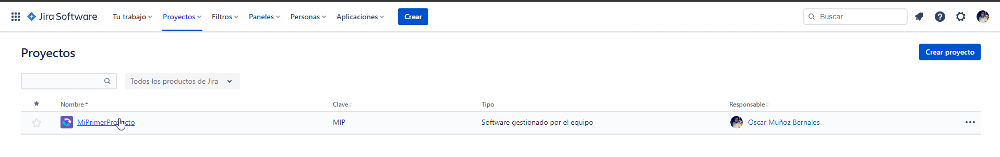

### Ver las incidencias de un proyecto.

![2022-09-13 00_16_40-[2022] Gestiona tu Proyecto Scrum con Jira Agile _ Udemy.png](img/2022-09-13_00_16_40-2022_Gestiona_tu_Proyecto_Scrum_con_Jira_Agile___Udemy.png)

## Entendiendo las aplicaciones de Atlassian.

Atlassian tiene una suit de software  que nos van a ayudar mucho a crear proyectos agiles, estos estan divididos en **Plan, track y Support**, **Collaborate** y **Code, build y Ship.**

- **Plan, track y support**:
    - **Jira software:** Es la solución número 1° para la gestión de proyectos y equipos agiles, que nos permite planificar y darle seguimientos a los sprint que tenga un proyecto a su ves nos permite generar reportes de seguimiento y de avances. Jira software basicamente nos va a permitir hacer:
        - **Planificación ágil**: crear proyectos, épicas e historias de usuario, planifica los sprints y destribuye las tareas dentro de su equipo de trabajo
        - **Monitoreo y seguimeinto**: Prioriza y discute el trabajo del equipo en un contexto de proyecto con visibilidad completa.
        - **Liberación**: Entrega con confianza sabiendo que la información que tienes está siempre actulizada.
        - **Reportes**: Mejora el rendimiento de tu equipo basado en datos visuales y en tiempo real.
        - **Integración**: Integración con otras aplicaciones de Atlassian, así como aplicaciones de terceros.
        
        Ademas jira software puede ser ocupado por diferentes actores en la metodologia ágil:
        
        - **Product Owners**: Pueden crear backlog, sprints y líneas de tiempo para las siguientes liberaciones importante.
        - **Project Manager / Scrum Masters**: Gestión del proyecto como tal, alcance, impedimientos, recursos para una liberación a tiempo.
        - **Developers**: Desarrollo, defectos y cualquier trabajo relacionado al proyecto.
    - **Jira Align**.
    - **Jira Core**.
    - **Jira Service Management**.
    - **Opsgenie**.
    - **Statuspage**.
- **Collaborate**.
    - **Confluence:** Es una herramienta simple y facil de usar para crear, compartir y organizar el trabajo con tu equipo.
        - **Crear y compartir de todo**: Notas de reunión, requisitos del producto, documentación técnica, planes de proyecto.etc.
        - **Versionado**: Seguimiento de cada versión, realiza cambios de forma segura y simple.
        - **Persona a persona**: Comparte, discute y recolecta retroalimentación con comentarios, menciones y like.
        - **Integración con Jira**: Conecta con Jira para enlazar planes de proyectos, seguimiento a documentos de rabajo y documentación técnica.
        - **Extendible con add-ons**: cientos de add-ons para temas, diagramas, gráficos y flujos a través del Atlassian Marketplace.
        - **Creado para equipos**: Dele a cada equipo, proyecto o departamentos su propio espacio para organziar su trabajo.
    - **Trello**.
- **Code, build and ship**.
    - **Bitbucket:** Administración de código git. Ofrece a los equipos un lugar para planificar los proyectos, colaborar en el código, probar he implementar. Bitbucket es un repositorio de código basado en git. acá algunas de las caracteristicas del software.
        - **Colaborativo**: FOmenta, haz cumplir y facilita las discuciones y garantiza la calidad del código fuente.
        - **Integraciones**: intégrate on las herramientas que conoces a través de API’s y webhocks, o aproveche los icnetos de add-ons disponibles en el Atlassian Marketplace.
        - **Seguro**: Seguridad a nivel empresarial con permisos especificos y controles de merge, hasta el nuvel de branch.
        - **Flexibilidad**: Flexibilidad en la implementación para aquillos que desean trabajar en la nube o detrás de su firewall.
        - **Escalabilidad**: Crece a medida que tú creces. Para aquillos que trabajarn detrás del firewall, comienza con un solo servidor y cambia a una implementación de centro de datos de múltiples nodos.
    - **Sourcetree**
    - **Bambo:** es una herramienta que nos permite hacer entrega continua, desde código hasta la implementación. Automatiza la creación, pruebas y despliegue. Que nos ofrece esta herramienta_
        - interfaz web centralizada: Administra los flujos de creación (build), pruebas y despliegue de tu software.
        - Automatización de software builds: Agentes locales y remoto. Soporta builds concurrentes, Triggers manuales y automatizados.
        - Despliegue automatizado: Despliega de manera automática a cada uno de los ambientes de tu sistema, controlando los permisos.
        - Pruebas (testing): Ejecuta pruebas automatizadas para hacer una regresión completa del producto con cada cambio identifica errores más rápidamente.
        - Integración: Bamboo cuenta con la mejor integración con Jira software, bitbucket, así como extensión con los add-ons del marketplace.

# Sección 2: Conceptos de SCRUM

## Conceptos básicos.

### ¿que es Scrum?

- Scrum es un marco de trabajo para gestión de proyectos ágiles.
- Se puede utilizar en cualquier tipo de proyecto, pero se usa principalmente en proyectos de software.
- Se ha utilizado para gestionar el trabajo en productos complejos desde principios de la década de 1990
- El concepto dividir proyectos grandes en etapas mas pequeñas, revisar y adaptar a lo largo del camino.

### Sprint.

- Es una iteración o período de trabajo en cual se debem completar las historias de usuarios asignadas.
- Las iteraciones pueden ser de 2 a 4 semanas (no se pueden exceder mas de 4 semanas).
- Entrega progresiva de valor.

### Épicas, historias de usuario y tareas.

- **Épica**: Funcionalidad o historia de usuario grande, que debe ser descompuesta en historias de usuarios mas pequeñas.
- **Historias de usuario**: Funcionalidad o requisitos que puede ser completado en un tiempo definido (horas o dias).
- **Tarea**: Pequeños incrementos de trabajo. Cada historia de usuario es descompuesta en tareas.

<aside>
💡 Como redactar una historia de usaurio:
Como **[Rol de usuario]** quiero **[Objetivo]** para poder **[Beneficio]**

</aside>

<aside>
💡 Como **Usuario web** quiero **consultar la tabla de pedidos** para **saber el estado de todos mis pedidos**

</aside>

### Story points: Estimación de esfuerzo.

Estimación ágil por historias de usuarios (Agile Estimation for User History), cada hisotria de usuario tiene una dificultad diferente y con esta tabla vamos a poder darle valor a cada UH

| Funcionality | 📦 | 📦📦 | 📦📦📦 | 📦📦📦📦 | 📦📦📦📦📦 |
| --- | --- | --- | --- | --- | --- |
| Relative diference | Smaller | Medium | Bigger | Biggest | …. |
| T-Shirt sizing | S | M | L | XL | … |
| Story point estimation | 1 | 2 | 3 | 5 | 8 |

### Roles centrales:

- **Dueño del producto (Product Owner)**: Es el encargado de crear y mantener el backlog del producto, definir las prioridades (en que orden se deben de entregar las UH). El PO es el intermediario con las otras areas de las empresas y con el cliente final.
- **Scrum master**: Lider, tiene que velar para que las ceremonias de scrum se realizen correctamente, ademas de ayudar a resolver los impedimientos del equipo.
- **Equipo de Scrum**: Es un equipo multidiciplinario, puede tener un dev, devops, arquitecto(s), diseñadores, etc.

### Artefactos:

- **Backlog del producto**: Es el conjunto de todas las historias de usuarios o epicas que se hayan definido.
- **Backlog del sprint**: Es un subconjunto del backlog del producto, se toma una cantidad de UH del backlog de producto y se agregan al Sprint, cada UH seleccionada se subdivide en tareas y en subtareas.
- **Incremento**: Al final de cada Sprint vamos entregando un valor gradual al final de producto.
- **Definición de terminado (done)**: Podemos decir que al final de cada Sprint hemos terminado con algunas UH, pero es importante definir algunas reglas que nos permitan establecer que una UH se haya completado, por ejemplo para que una UH se concidere terminada (done) el equipo de QA tiene que haber certificado la UH.

### Eventos / Reuniones:

- Planificación de Sprint: Planificar las UH que se realizaran en el Sprint. detallar y asignar.
- Daily Standup (Scrum diario): El equipo tiene que responder ¿Que hizo ayer?¿Que haras hoy?¿Cuales son tus impedimentos?
- Revisión del Sprint: Se hace una demostración de todos los requerimientos finalizados dentro del Sprint.
- Retorspectiva el sprint: El equipo tiene que exponer **que se hizo mal, que se hizo bien, qué inconvenientes se encontraron.**

## ¿Porqué utilizar SCRUM?

- **Adaptable**
    - Proyectos adaptables a medida que pasa el tiempo.
    - Incorporación del cambio.

- **Resolución de problemas mas rapido.**
    - Colaboración.
    - Resolver impedimientos.

- **Transparencia**
    - Información compartida (tablero Scrum).
    - Ambiente de trabajo abierto.

- **Entregables más efectivos.**
    - Backlog priorizado.
    - Revisiones periódicas de entregables.

- **Retroalimentación continua.**
    - Daily stamdup.
    - Revisar y demostrar Sprint.

- **Centrado en el cliente.**
    - Enfasís en el valor del negocio.
    - Entorno de colaboración con stakeholders.

- **Mejora continua y motivación**.
    - Refinar el Backlog
    - Restrospectiva.

- **Ambiente de alta confianza.**
    - Transparencia y colaboración.
    - Baja fricción entre colaboradores.

- **Entrega continua de valor.**
    - Proceso iterativo.
    - Entegrables de forma progresiva.

- **Responsabilidad colectiva.**
    - Comprometer istorias de usuarios.
    - Hacer suyo el proyecto.

- **Ritmo sostenible**
    - Duración definida dl Sprint.
    - Diseñado para ritmo sostenible.

- **Alta velocidad.**
    - Entregas progresivas y priorizadas.
    - Cliente percibe velocidad en los entregables.

- **Entrega anticipada de alto valor.**
    - Backog priorizado.
    - Entrega de requisitos de mayor valor.

- **Ambiente imnovador.**
    - Retrospectivas de Sprint y proyecto.
    - Apendizaje, adaptación que conllevan a un ambiente de trabajo innovador y creativo.
- **Proceso de desarrollo eficiente.**
    - Time-boxing (tiempo fijo definido).
    - Reducción de desperdicio.

## Flujo de SCRUM.

### Guía SBOK.

La guía para el cuerpor de conocimientos de Scrum (Guía SBOK) proporcina directrices para la aplicación con exito de Scrum: el desarrollo ágil de productos y el método de entrega de proyectos más popular. Brinda un framework integral que incluye los principios, aspectos y procesos de Scrum.

### Fases genéricas de un proyecto.

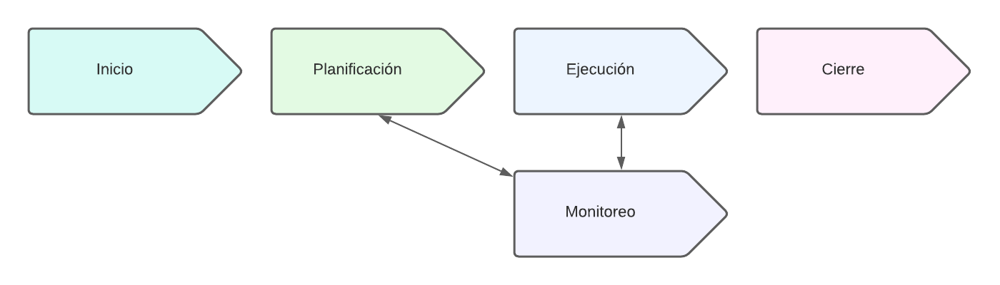

### Ciclo de vida de un proyecto de software.

.png)

### Flujo de Scrum

.png)

El flujo del Scrum comienza con el caso de **negocio del proyecto (bussines key)**, este es un documento en donde justificamos la necesidad de crear un producto dentro del mercado o dentro de la organización. Luego pasamos a la **declaración de la visión del proyecto** es en donde se describen los objetivos y la meta del proyecto. El siguiente item dentro del flujo es el **Backlog priorizado del producto** es en donde se defininen un listado de requisitos funcionales y no funcionales que se deben realizar para poder dar por finalizado el producto, dentro de esta etapa vamos a crear el **cronograma de planificación del lanzamiento** que es en donde vamos a indicar en que momento vamos dar por finalizado el producto, la definición de sprint, etc. Luego pasamos a realizar los diferentes **Sprint** durante el proyecto.

## Principios.

### Principios de Scrum.

- Fundamentos básicos para implementar el framework.
- Estos principios pueden aplicarse a cualquier tipo de proyecto u organización y deben respetarse a fin de garantizar la aplicación adecuada de Scrum.
- Los aspectos y procesos de Scrum pueden adecuarse para cumplir con los requerimientos del proyecto o de la organización que los usa.

### Control de procesos empíricos.

- En Scrum, las descisiones se basan en la observación y la experimentación en vez de la planificación inicial detallada.
- El control de proceso impíricos se basa en 3 ideas principales:
    - **Transparencia**: Transparencia es, **mostrar los echos tal cual** son, es compartir la información del proyecto para que todos los miembros puedan acceder a ella. La transparencia permitie que todas las facetas de cualquier proceso de Scrum sean observadas por cualquiera, esto promueve un flujo de información fácil y transparente en toda la organización y crear una cultura de trabajo abierta.
    - **Inspección**: El concepto de inspección es **revisar y obtener retroalimentación** atraves de:
        - Uso de un Scrumboard común y otros radiadores de información que muestran el progreso del equipo Scrum en completar las tareas del Sprint actual.
        - Recopiliación de la retroalimientación del cliente y otros Stakeholders durante los procesos de desarrollo de épica(s). Crear Backlog Priorizado del Producto y realizar planificación del proyecto.
        - La inspección y aprobación de los entregables por parte del Product Owner y el cliente en proceso de demostrar y validar el Sprint.
    - **Adaptación:**
        - La adaptación en este contexto se refiere a la **mejora continua**, la capacidad de adaptación basada en los resultados de la inspección.
        - La adaptación se da cuando el equipo principal de Scrum y los Stakeholders aprenden mediante la transparencia y la inspección, y después se adaptan al hacer **mejoras en el trabajo** de que llevan acabo.

### Auto-organización.

- Scrum sostiene que los empleados cuentan con motivación propia y que buscan aceptar mayores responsabildiades. Por tanto, ofrecen mucho más valor cuando se organizan por cuenta propia.
- El estilo de liderazgo preferido en Scrum es el de **liderazgo servicial**, el cual enfatiza el logro de los resultados, enfocandose en las necesidades del **equipo Scrum.**
- Esto es un concepto ideal, pero en la vida real es dificil lograr. Generalmente habrá que hacer inspección y empuje constante para lograr los objetivos.

### Colaboración.

- La colaboración en Scrum se refiere a que el equipo principal de Scrum **trabaja e interactua** con los Stakeholders para crear y validar los resultados del proyecto a fin de cumplir con los objetivos que se plantean en la visión del proyecto.
- La colaboración se produce cuando **integramos el aporte** individual de cada miembro del equipo a fin de producir algo mas grande.
- Se prefiere la Co-ubicación (equipos en la misma oficina).

### Priorización basa en valor.

- El framework de Scrum se guía con la finalidad de ofrecer el **máximo valor empresarial** en un mínimo valor de tiempo.
- Una de las herramientas más eficaces para entregar el mayor valor en el menor tiempo posible es la **priorización.**
- La priorización se puede definir como la determinación del orden y la separación de lo que se debe hacer ahora, de lo que se debe hacer despues.

### Time-boxing.

- Scrum trata el tiempo como una de las **limitantes más importante** en la gestión de un proyecto.
- Para hacer frente a la restricción del tiempo, Scrum introduce un concepto de Time-Boxing (**asignación de un bloque de tiempo**), que propone la fijación de cierta cantidad de tiempo para cada **proceso y actividad** en un proyecto Scrum.
- Ejemplo:
    - Los tiempos se pueden configurar.
    - Se tiene que adaptar a la organización.
    
    .png)
    

### Desarrollo iterativo.

- En lugar de entregar al final de proyecto, Scrum promueve el desarrollo iterativo y progresivo de entregables.
- El modelo iterativo es más flexible permitiendo incorporar cambios que solicite el cliente como parte del proyecto.
- El desarrollo iterativo permite la corrección, a medida que todas la personas involucradas obtengan una majer comprensión de lo que se debe entregar como parte del proyecto.
- El equipo produce entregables que se adapten mejor al entorno empresarial.

## Aspectos.

- **Organización**.
    - **Roles centrales**:
        - **Product Owner o dueño del producto**: Es la la voz del cliente, administrador del backlog, es el encargado de maximizar el valor del producto y tambien es su deber justificar el proyecto.
        - **Scrum Master**: Es un facilitardor (su deber principal es tener el ambiente adecuado para que el equipo trabaje comodamente), debe remover impedimientos del equipo y garantizar el cumpliento de las normas de Scrum. El Scrum Master ademas de facilitar el trabajo al equipo, tambien es el encargado de interactuar con la organización, dueño del producto y con el equipo scrum.
        - **Equipo Scrum**: Son personas con diferentes habilidades, el equipo tiene que entender requisitos y poder trabajar para poder crear entregables.
    - **Roles no centrales**: Stakeholders o interesados en el proyecto, Scrum Guidance Body (SGB) grupo de agentes externos expertos y vendedores (individuos u organización externa).
- **Justificación del negocio**
    - **Entrega impulsada por el valor**, vamos a crear un producto que nos de valor al negocio
    - **Incertidumbre sobre los resultados**, no sabemos con que obstaculo nos vamos a encontrar, pero a medida que vamos entregando resultados en los sprints la incertidumbre va bajando progresivamente.
    - **La adaptatibilidad** de Scrum permite que los objetivos y procesos del proyecto cambien, si se justifica ante al negocio.
- **Calidad**
    - En Scrum, la calidad se define como la capacidad con la que cuenta el producto o los entregables para cumplir con los criterios de aceptación y de alcanzar el valor de negocio que el cliente espera.
    - Enfoque en la mejora continua.
    - Aseguramiento y control de calidad iterativo.
- **Cambio**
    - Scrum está diseñado para aceptar cambios.
    - Requisitos volátiles (los interesados cambian sus requisitos a lo largo del proyecto)
    - Las organizaciones deben tratar de maximizar los beneficios que se deriven de los cambios y minimizar cualquier impacto negativo a través de procesos de gestión de cambios diligentes.
- **Riesgo**
    - Riesgos positivos: Oportunidades.
    - Riesgos negativos: Amenazas.
    - La gestión de riesgos debe hacerce de forma preventiva y proactiva, y es un proceos iterativo que debe comenzar al inicio del proyecto y continuar a lo largo del ciclo de vida del mismo.
    - Plan de respuesta a riesgos.

# Sección 3: Crear proyectos.

## Creando un proyecto de Jira Agile

Para poder crear un proyecto en Jira Software tenemos que ir a nuestro dashboard y seleccionar “Crear proyecto”

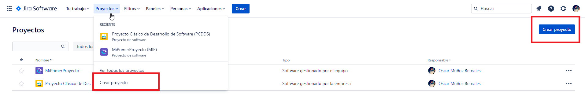

Luego atlassian nos va a mostrar un menú de plantillas que tiene por defecto para que nosotros podamos crear nuestros proyectos, para propositos de este curso nosotros vamos a crear el proyecto seleccionando la plantilla “**Desarrollo de software”** y luego seleccionamos la opción “**Scrum**”.

Luego presionamos “siguiente” y nos va a preguntar que tipo de proyecto vamos a crear **proyecto gestionado por el equipo (nextgen)** y **proyecto gestionado por la empresa:**

- **Gestionado por el equipo**: Es una plantilla muy simplificada y  facil de usar, toda la configuración es gestionada por el equipo va dirgido a un equipo de no mas de 25 personas.
- **Gestionado por la empresa**: Acá existe un administrador o un grupo de administradores que son responsables de la configuración de la plantilla, antes se llamaba proyecto clásico.

Luego de seleccionar el tipo de proyecto que vamos a crear el nombre del proyecto (ademas de agregar confluence, bitbucket, etc).

## Gestión de usuario, grupos y permisos.

Para poder invitar a nuestro equipo al tablero de Jira tenemos dos opciones para poder hacerlo.

- Invitarlo desde la barra de navegación en la parte de arriba

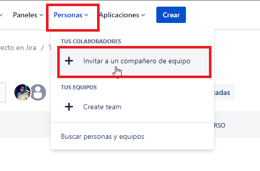

- Invitarlo desde la ventana de administración. En seleccionando el boton de configuración y luego gestión de usuario.

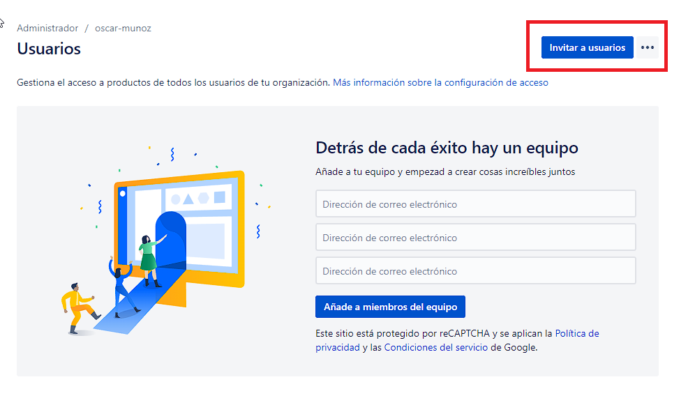

En ambos casos solo tenemos que ingresas el correo y asignarle el usuario que van a tener al momento de ingresar.

### Grupos.

Los grupos en Jira son contenedores de usuarios que nos sirve para dar acceso a los diferentes productos de atlassian. Para poder acceder la configuración de los grupos de cada proyecto tenemos que ir al panel de administración, directorio y grupos, ahí vamos a ver la cantidad de grupos creados y cuantos usuarios hay por grupo.

Jira viene cargado con 4 grupos predefinidos estos son los siguientes:

- **Adminnistrator**: Este grupo tiene acceso al producto y a la administración de Jira.
- **Jira administrator**: Este grupo solo tiene acceso a la administración.
- **Jira software user**: Este grupo solo tiene acceso al producto.
- **site-admin**: Este grupo tiene acceso al producto y a la administración pero de todos los productos que están instalados (este es el grupo con mayor privilegios).

### Acceso al sitio.

Nostros como administradores podemos configurar que dominios se les puede enviar una invitación a que otros no, ademas de configurar si queremos crear una URL global de invitación etc.

Dentro del proyecto, administración, Prouductos y Configuración de acceso de usuarios tenemos 3 opciones **Dominios aprobados**, **Invitaciones de usuario**, **Enlaces de envitación**.

- **Dominios aprobados**: Acá podemos definir que dominio va a ser aprobado para poder ingresar al sitio del proyecto de Jira, podemos dejar que cualquier dominio con invitación pueda entrar o seleccionamos el dominio para poder filtrar a los usuarios.

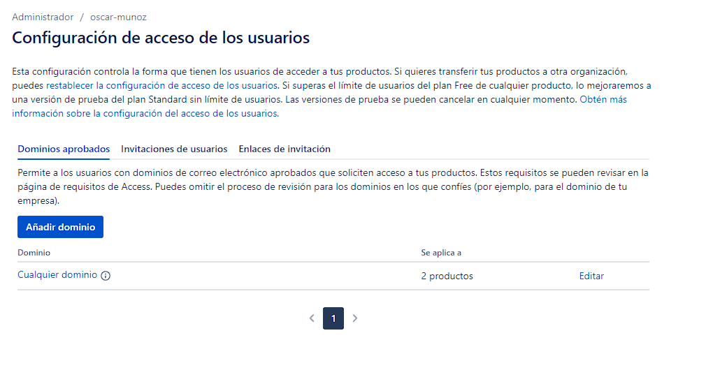

- **Invitaciones de usuario**: Acá podemos configurar que cualquier usuario pueda invitar a otros usuarios a unirse al proyecto (a cada producto en especifico) no es recomendable dejar esta opción abierta a todos los usuarios, más bien es mejor que el administrador del producto tenga los permisos para envitar a su equipo el proyecto.

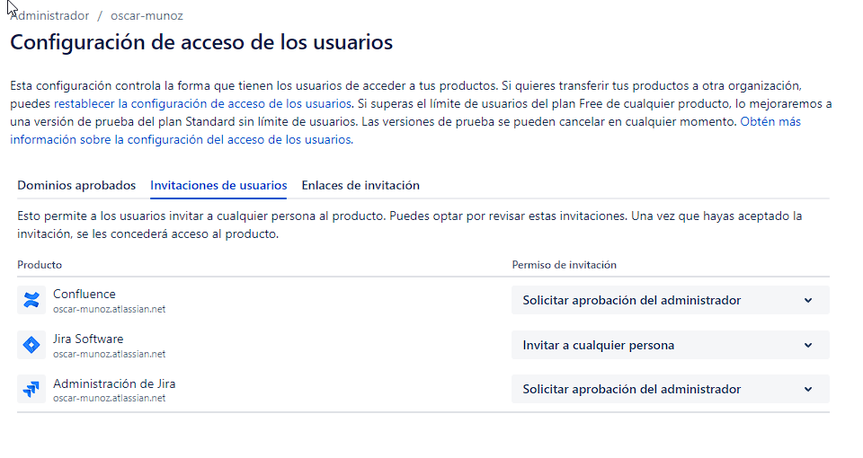

- **Enlaces de envitación:** Acá vamos a poder definir si queremos crear enlaces de invitación de forma global, esto quiere decir que cualquiera que tenga el enlace podrá acceder al producto seleccionado.

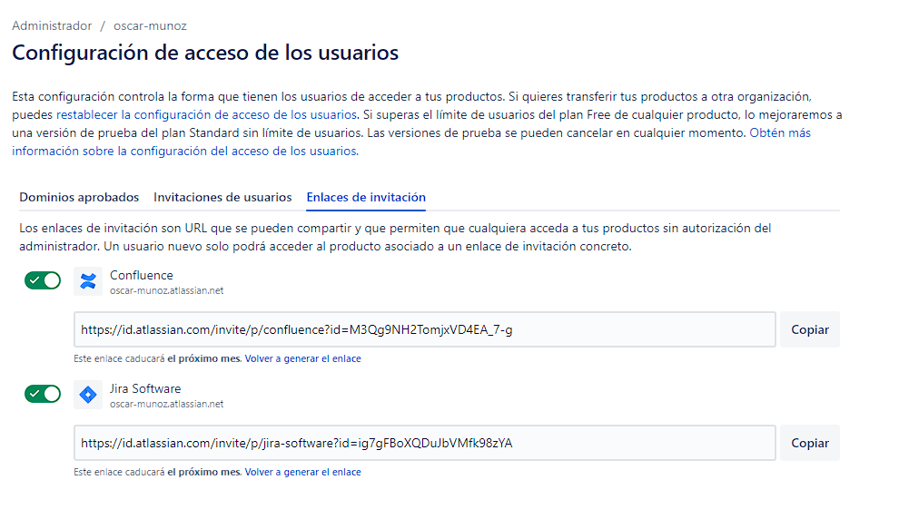

### Como dar acceso a los productos (jira software, confluence, bitbucket, etc).

Para poder dar acceso a los productos del sitio, solo tenemos que movernos al apartado de “**Productos**”, estando en esa página vamos a ver la cantidad de productos que poseemos actualmente y ademas vamos a poder “**Gestionar acceso**” y luego nos aparecerá una página con todos los grupos que tienen acceso a ese producto y ademas vamos a poder agregar un nuevo grupo.

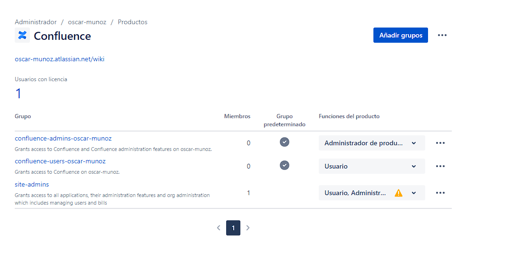

### Como crear un grupo en Jira.

Básicamente para crear un grupo nos vamos a la pestaña de personas y creamos un grupo, invitamos a nuestro equipo al grupo que queremos que pertenezca y desde ese grupo de la damos acceso a los diferentes productos de atlassian (jira software, confluence, bitbucket etc).

# Sección 4: Crear el backlog del producto.

## Tipos de insidencias (Issues) en Jira.

Los tipos de issues se definen el tipo de trabajo que se registra en un proyecto en Jira. Al momento de crear una nueva insidencia nos permite seleccionar el tipo, cuando creamos un proyecto en jira vienen algunos predefinidos:

- **Épica (Epopeya)**: Una funcionalidad grande que debe ser descompuesta en historias de usuarios.
- **Historia de usuario**: Una UH es un requerimiento o funcionalidad desde la perspectiva del usuario.
- **Error (bug)**: Defecto que necesita ser corregido.
- **Tarea**: Es una unidad de trabajo.
- **Sub-tarea**: es parte de una incidencia. Cualquier incidencia se puede descomponer en sub-tareas.
- **Personalizado**: Es un tipo de incidencia personalizada.

### ¿Porqué los tipos de incidencias?

- Registra diferentes tipos de unidad de trabajo.
- Cada tipo puede tener diferentes campos , pantallas, y workflows (proyecto classic).
- Generar reportes sobre los tipos especificos.

### Épicas.

- Una funcionalidad grande que se puede descomponer.
- Puede abarcar varios sprints, equipos, proyectos y tableros.
- Se puede utilizar como contenedor de múltiples historias de usuarios.
- Puede contener otros tipos de incidencias.
- Ayudan a organizar el trabajo y simplicar el backlog.

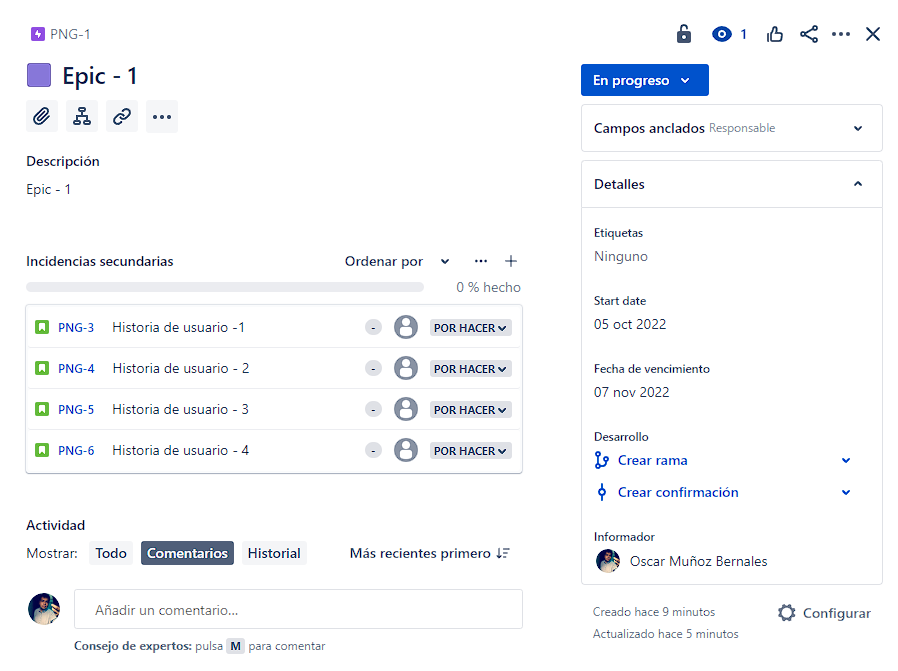

### Historia de usuario (User History).

- Requerimiento o funcionalidad desde la perspectiva del usuario.
- Puede estar o no asociada a una Épica (incidencia padre).
- Puede contener sub-tareas.
- El formato de redacción de una historia de usuario viene siendo

<aside>
💡 Como [ROL DEL USUARIO] quiero [OBJETIVO] para poder tener [BENEFICIOS]

</aside>

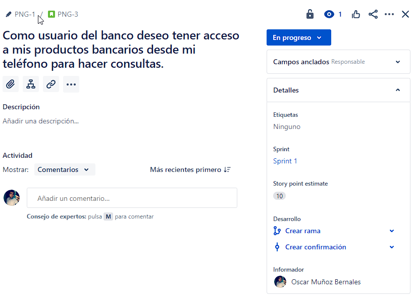

### Tarea (task).

- Una unidad de trabajo que no necesariamente está relacionada a una funcionalidad o requerimiento de usuario.
- Se pueden utilizar para registrar requerimientos no funcionales.

### Error (bug).

- Un defecto que necesita ser corregido.
- Durante los ciclos de testing, se puede utilizar este tipo de incidencia para registrar los defectos encontrados en el software.
- El defecto debe ser asignado a un miembro del equipo para ser corregido y luego verificado por QA.

### Sub-tarea (subtask).

- Una sub-tarea debe tener una incidencia padre.
- Permiten que una incidencia pueda ser descumpuesta en unidades de trabajo más pequeñas.
- Pueden ser descritas en un lenguaje más técnico que la incidencia padre.

## Registrar los criterios de aceptación.

Los criterios de aceptación son:

- Brindan claridad al equipo respecto a lo que se espera en una historia de usuario. Deben ser precisos.
- Eliminan la ambigüedad de los requerimientos, ayudando a la alineación de las expectativas.
- Es responsabilidad del dueño del producto apoyado del equipo de QA definir y comunicar los criterios de aceptación al equipo Scrum.
- Brindan contexto para que el dueño del producto y el equipo de QA decidan si la historia de usuario se ha completado satisfactoriamente.

Los elementos que debemos considerar en los criterios de aceptación son los siguientes:

- **Interfaz grafica**: aspectos y posición.
- **Validaciones**: reglas de validación, mensajes al usuario.
- **Comportamiento**: que sucede al oprimir el un botón?.
- **Flujo**: Hacia donde y como debe fluir la información.
- **Resultado esperado**: lo que se obtiene como resultado.
- **Seguridad**: características de seguridad requerida.
- **Rendimiento**: velocidad o performance requerido.

Ejemplo: tenemos la siguiente UH.

<aside>
📖 **Como** director del Área de recursos humanos, **quiero** un reporte de los días de vacaciones por empleado en el sistema de administración de vacaciones **para** conocer las fechas en que los trabajadores estarán disponibles durante el año.

</aside>

Entonces los criterios de aceptación van a ser los siguientes:

- La información del reporte debe exportarse a excel.
- La pantalla tiene los campos de fechas de inicio y fin de vacaciones para seleccionar el rango del reporte, así como los botones de OK y cancelar.
- Al presionar OK el reporte debe generar una gráfica que muestre por mes los días de vacaciones de cada empleados.
- El reporte debe de poder ser visto sólo por el responsable del área con un usuario y contraseña.
- El reporte no debe generarse en más de 5 segundos.

Jira no tiene un campo especifico para crear los criterios de aceptación, pero podemos agregar un campo de texto en las UH.

## Registrar estimaciones.

Las estimaciones:

- Las estimaciones se utilizan para dimensionar el esfuerzo o la complejidad para desarrollar una actividad del proyecto.
- En jira podemos estimar usando:
    - Puntos de historia (history point).
    - Tiempo.

Para poder estimar con puntos de historia podemos utilizar la siguiente tabla

| Funcionalidad | 📦 | 📦📦 | 📦📦📦 | 📦📦📦📦 | 📦📦📦📦📦 |
| --- | --- | --- | --- | --- | --- |
| Relative difference  | Smaller | Medium | Large | Bigger | extra bigger |
| T-shirt sizing | S | M | L | XL | XXL |
| History point estimation | 1 | 2 | 3 | 5 | 8 |

# Sección 5: Definición y ejecución de sprints

## Crear un Sprint y el Backlog del Sprint.

## Iniciar y finalizar un Sprint.

## Configurar el tablero del Sprint

## Asignar incidencias al equipo y al Sprint.

# Sección 6: Crear el roadmap.

## La planificación del lanzamiento o roadmap.

## Crear la hora de ruta en un proyecto.

## Crear un roadmap avanzado.

## Versiones.

## Componentes.

# Sección 7: Reportes y filtros.

## Búsqueda y filtros.

## Aprende sobre JQL (Jira query language)

## Revisión y retrospectiva del sprint.

## Reportes en proyectos de última generación

## Reportes en proyectos clásicos.

# Sección 8: Automatización y workflow.

## Fundamentos de automatización.

## Ejemplos de automatización.

## Uso de workflow y sus beneficios.

## Creando mi workflow a la medida.

# Sección 9: Bonus.

## Confluence: Documentos y colaboración

## Software Testing con Jira + Zephyr Add-on