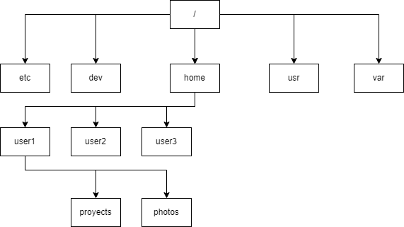

# Introducción a la terminal y línea de comandas

- Valoración: ⭐⭐⭐⭐⭐
- Estado: Terminado
- Fecha de inicio: November 23, 2022 5:07 PM
- Página: Platzi

# 1. Introducción.

# 1.1. ¿Qué es la terminal?

La terminal es un programa que ejecuta líneas de comandos, que a su vez estas líneas de comando ejecutan acciones y aquí tienes que aprender dos conceptos: **terminal** y **shell.**

### Concepto de terminal

Estamos muy acostumbrados a que en nuestra computadora inicie un sistema operativo que tenga un sistema de ventanas en el que podemos abrir carpetas y programas y podamos mover archivos a través de una interfaz gráfica.

La terminal es otra ventana más, es un programa, una interfaz que recibe un comando para luego pasárselo a la **shell** y que esta última la ejecute. Con este programa podemos hacer todo lo que el sistema de carpetas e interfaz gráfica del sistema operativo puede hacer, pero utilizando comandos.

### Concepto de shell

Ahora la **terminal** no ejecuta líneas de código, solo la recibe, es la **shell** quien hace todo el proceso de tomar el comando, ir con el procesador y la memoria RAM y decirles “tomen, ejecuten esto”.

Si lo pensamos de otra forma, la **shell** nos proporciona una forma de comunicarnos con el procesador y la RAM sin tener que pasar por la interfaz gráfica.

### ¿Por qué usar la shell y no la interfaz gráfica?

Al final del día, la interfaz gráfica, como lo es el sistema de ventanas, es un programa más y como programa que es ocupa espacio en la memoria. De hecho, si estás en Windows 10 y abres el administrador de tareas en la pestaña Procesos, en el grupo Procesos de Windows, encontrarás uno llamado Explorador de Windows.

Este programa no es todo el sistema de ventanas, pero si es todo el sistema de ficheros y como podemos ver ocupa espacio en CPU y en memoria RAM.

La **terminal** es mucho menos pesada que el sistema de ventanas y el sistema de ficheros porque te comunicas directamente con los recursos del sistema operativo sin pasar por la interfaz gráfica.

Además hay casos en los que no cuentas con una interfaz gráfica o también puede dañarse y tendrás que resolver utilizando la terminal de comandos.

## 1.2. Aprendiendo a caminar en la terminal.

En los sistemas operativos organizamos los archivos en una estructura de carpetas en forma de árbol jerárquico. Este árbol cambia dependiendo de los diferentes sistemas operativos (no tanto en Linux y Mac).

### Cómo funciona el sistema de carpetas

El sistema operativo con el que trabajaremos es Linux, por lo tanto usaremos su estructura. Observa el siguiente esquema:



La carpeta con el símbolo “/” es la raíz, ahí es donde comienza todo el sistema de ficheros (el equivalente en Windows podría ser el fichero “C:\”). Dentro de esta carpeta hay varios ficheros, el que nos importa en este momento es el “Home”.

La carpeta “Home” contiene una carpeta por cada usuario del sistema y ya dentro de cada una de estas carpetas, estarán las carpetas que conocemos de toda la vida como imágenes, documentos, música, etc.

### Cómo entender la información al inicio de la terminal

Cuando abrimos la terminal vamos a ver algo como esto:

```jsx
usuario1@DESKTOP-3R804MK:~$
```

Todo esto parece un mensaje encriptado, pero es más sencillo de lo que parece, vamos por partes:

- **usuario1:** es el nombre del usuario que está activo. En tu caso aparecerá el nombre del usuario que esté activo en tu computadora.
- **DESKTOP-3R804MK** es el nombre que el sistema operativo le dio a la computadora. En este caso se usa Windows y ese es el nombre que en la instalación Windows le asignó al dispositivo. Si usas Linux aparecerá el nombre del PC que hayas colocado en la instalación.
- **~** es la carpeta en la que te encuentras y ahora es cuando empiezan las confusiones porque en el esquema no estaba una carpeta con ese símbolo. Más adelante verás como todo tiene sentido.
- Por último, **$** significa que somos un usuario normal y no un root o un superusuario. Más adelante hablaremos más acerca de esto.

### Tu primer comando (pwd)

Ahora sí, vamos con el poderosísimo comando que te ayudará a descubrir algo muy importante: ¿dónde estás?

Vimos que el símbolo **~** indica la carpeta donde te encuentras, ¿cuál es esa carpeta? Para saberlo escribe el siguiente comando:

```
pwd
```

Te debió haber aparecido algo como esto:

```
/home/usuario1
```

El comando pwd, significa **Print Working Directory** y te muestra el directorio en el que te encuentras. En este caso dice que estoy en el home del usuario que es miguelangel.

### Usar el comando Change Directory (cd)

No trabajarás todo desde la misma carpeta, así que necesitas saber como moverte entre carpetas sin salir de la terminal. Para eso usamos el comando `cd` que significa **Change Directory**.

Para usarlo escribimos `cd` seguido del directorio al que queremos movernos, por ejemplo, dentro del home tengo la carpeta Documents, así que para moverme ahí escribo:

```
cd Documents

```

Y ahora vemos que la información que nos muestra la consola cambió y nos indica donde estamos:

```
usuario1@DESKTOP-3R804MK:~/Documents$

```

### Atajos

### Virgulilla (~)

De seguro te preguntarás porqué la virgulilla (~) indica la carpeta del usuario en el home, ¿cuál es la utilidad? Supongamos que estamos navegando por diferentes carpetas y nos encontramos en la siguiente dirección:

```
usuario1@DESKTOP-3R804MK:/mnt/c/users/migue/development$
```

(Si estás usando WSL, eso significa que estás buscando entre carpetas que están en Windows)

Si ahora quieres volver al home habría que escribir el siguiente comando:

```
cd /home/miguelangel

```

Pero puedes mejor escribir:

```
cd ~

```

Y llegas más rápido.

### Punto y doble punto (.) (…)

No siempre quieres ir hacia adelante, a veces necesitas devolverte, para eso utilizas el atajo del doble punto (…) que te envía a la carpeta que está atrás. Si haces esto:

```
usuario1@DESKTOP-3R804MK:~$ cd ..

```

Como estás en la carpeta del usuario, pasarás a estar en la carpeta de home.

Por otro lado, el punto (.) índica la carpeta actual, así puedes hacer direcciones más precisas como esta:

```
usuario1@DESKTOP-3R804MK:/home$ cd ./usuario1/Documents/

```

### Slash (/)

Por último, el atajo slash te lleva a la raíz donde están todas las carpetas del sistema operativo.

```
usuario1@DESKTOP-3R804MK:/mnt/c/users/migue$ cd /
usuario1@DESKTOP-3R804MK:/$
```

## ¿Cómo saber lo que hay adentro de las carpetas? (ls)

No siempre vas a saber lo que hay adentro de las carpetas, por lo que necesitas listar lo que hay dentro, para eso está el comando `ls`, por lo general le dan el significado de **L**i**s**t.

Si ejecutamos el comando `ls` veremos las carpetas y archivos que hay dentro:


Como puedes ver, cada nombre tiene un color diferente. Para este caso el azul oscuro es para las carpetas y el claro es para los archivos, esto dependerá de la paleta de colores que tenga tu terminal.

Pero, ¿qué tal si queremos conocer más información? Para saber información adicional como la fecha de creación, el peso, los permisos, etc., utilizamos la opción `-l` que significa **Long**:


Ahora nos muestra una tabla que tiene mucha información que estaremos viendo más adelante, pero céntrate en la quinta columna, esos números son el peso, pero el peso en bytes, lo cual lo hace un poco complicado de leer. Podemos añadir la opción `-h` que significa **Human Readable**:


**Nota**: para añadir más de una opción no hacemos esto `ls -l -h` sino esto `ls -lh`

## Uso del comando file

Con el comando `ls` podemos listar los elementos dentro de una carpeta, pero a veces no sabemos si es una archivo o si es una carpeta o lo que sea.

Para eso tenemos el comando `file` que te da información acerca del tipo de elemento que hayas seleccionado:


En este caso vemos que el comando

```
file
```

nos dice que “dev” es un directorio y “lib” es un enlace simbólico.

| Comando | Función |
| --- | --- |
| pwd | Print Working Directory Muestra en la carpeta en la que estas |
| cd | Change Directory Te mueve a la carpeta que desees |
| ls | List Lista los archivos y carpetas dentro del directorio que selecciones |
| file | Muestra la información del archivo que selecciones |

## 1.3. Manipulando archivos y directorios.

Una vez has aprendido a [moverte entre carpetas](https://platzi.com/clases/2292-terminal/37342-aprendiendo-a-caminar-en-la-terminal/) y como listar los contenidos de las carpetas, puedes aprender cómo manipular archivos.

## Cómo crear un directorio (mkdir)

El comando `mkdir` de **Make Directory** es muy fácil de usar, simplemente escribe delante del comando el nombre del directorio que quieres crear:

```
mkdir DirectorioInteresante
```

También puedes crear varios directorios al mismo tiempo.

```
mkdir DirectorioInteresante SecretosDeEstado
```


## Cómo crear archivos (touch)

El comando `touch` funciona igual que el comando `mkdir`, solo escribe el nombre de los archivos que quieres generar delante del comando.

```
touch Secreto1 Secreto2 SecretoSecretario
```


## Cómo copiar archivos (cp)

Para copiar un archivo usando la terminal solo debes escribir el comando `cp` (cp es de **Copy**) seguido del nombre del archivo que deseas copiar y, por último, el nombre con el que quieres que se guarde la copia.

```
cp [nombreDelArchivoParaCopiar] [nombreParaLaCopia]
```

```
cp Secreto1 Secreto_bk
```


## Cómo mover un directorio (mv)

La sintaxis para el comando `mv` (mv es de **Move**) es igual que la del comando `cp`. Primero el nombre del archivo que quieres mover y luego a donde se va a mover.

```
mv [archivoParaMover] [destinoDelArchivo]
```

```
mv SecretoQueSeHizoPublico ../SecretosPublicos/
```


## Cómo eliminar archivos (rm)

Otra vez, la sintaxis es muy sencilla. Solo debes escribir el nombre o la ruta del elemento que quieres eliminar delante del comando `rm` (rm es de **Remove**)

```
rm [nombreDelArchivoParaEliminar]
```

```
rm SecretoQueNadieDebeVer
```


El comando `rm` tiene varias opciones. Las más usadas son:

- `i` (de interactive) te pregunta si estás seguro de eliminar el archivo
- `r` (de recursive) elimina todo lo que esté dentro de una carpeta
- `f` (de force) fuerza a borrar todo.

Veámoslo en consola:


La opción `-f` se usa cuando no puedes borrar algún archivo, bien sea porque algo lo está usando o porque se está ejecutando.

## Tabla de comandos

Aquí tienes una tabla que te ayudará a recordar todos estos comandos:

| Comando | Función |
| --- | --- |
| mkdir | Make Directory Crea carpetas |
| touch | Crea archivos |
| cp | Copy Copia archivos |
| mv | Move mueve archivos |
| rm | Remove elimina archivos o carpetas |

## 1.4. Explorando el contenido de nuestros archivos.

Al [manipular archivos y directorios](https://platzi.com/clases/2292-terminal/37344-manipulando-archivos-y-directorios/) necesitas aprender cómo verlo. A continuación te explicamos lo que debes hacer.

### Vistazo rápido al contenido usando los comandos Head y Tail

En español, cabeza y cola tienen una funcionalidad muy sencilla, `head` imprime las primeras 10 líneas de un archivo y `tail` imprime las 10 últimas líneas.

La sintaxis de ambos es bastante sencilla, solo tienes que escribir el nombre del documento que quieres revisar delante del comando que quieras usar.


Aquí puedes ver como podemos inspeccionar un documento HTML tanto las primeras como las últimas líneas.

Pero hay algo más, si no quieres ver las primeras líneas, sino que quieres ver las primeras 20, por ejemplo, entonces usas la opción `-n` seguida del número de líneas que quieres ver.

```
head proyecto.html -n 20

```


### Observar todo el contenido usando el comando Less

¿Y qué tal si quieres ver todo el documento? Pues siguiendo la sintaxis de `head` y `tail` escribes el nombre del archivo que quieres abrir delante del comando `less`.

```
less [nombreDelArchivoParaAbrir]

```


Ahora tendrás una especie de interfaz gráfica donde podrás inspeccionar el documento. Puedes usar las flechas y el scroll para moverte arriba y abajo.

Además, puedes buscar palabras dentro del documento. Si presionas la tecla slash “/”, en la parte de abajo se habilitará un cuadro donde podrás buscar palabras, solo escribe y presiona enter.


Para salir de la interfaz presiona “q”.

### Abrir en un programa el archivo cpn el comando xdg-open

El comando `xdg-open` es sencillo porque hace algo muy simple, abre el archivo que desees en el programa predeterminado para su extensión.

Por ejemplo, si quieres abrir un documento HTML, se abrirá el editor predeterminado para ese tipo de documentos.

### ¿Qué hacer si aparece un error?

Puede que cuando estés usando `xdg-open` te aparezca un error:


El mensaje dice: “Comando ‘xdg-open’ no encontrado, pero puede ser instalado con: sudo apt install xdg-utils” Si no tienes buen dominio del inglés no te preocupes en [Platzi Academy](https://platzi.com/ingles/) tenemos toda una escuela para aprender inglés, la cual deberías tomar si quieres ser una buena desarrolladora o un buen desarrollador.

Volviendo al tema, la solución es sencilla. Si usas un comando que no tienes, como si quieras usar VS Code sin instalarlo, debes prestar atención al mensaje y utilizar el comando para poder usar el comando `xdg-open`.


Luego de que te hayas sentido como un/a hacker por haber instalado un paquete desde la consola, continuamos con nuestras vidas como futuros desarrolladores/as y utilizamos `xdg-open` para abrir un documento HTML:

```
xdg-open [archivoParaAbrir]

```

Al ejecutar el comando para un archivo de extensión “.html” abre una interfaz similar a la de `less`, pero es porque no tenemos configurado un programa predeterminado para ese tipo de archivo, sin embargo, abrimos un archivo PDF usando la terminal:


## Abrir una carpeta usando el comando Nautilus

¿Te acuerdas que las ventanas también son un programa? Pues como todo programa lo podemos ejecutar desde la consola usando el comando `nautilus` se usa igual que `xdg-open`, solo que debes seleccionar una carpeta.

## Tabla de comandos

| Comando | Función |
| --- | --- |
| head | Muestra las primeras 10 líneas |
| tail | Muestra las últimas 10 líneas |
| less | Muestra todo el contenido dentro de la consola |
| xdg-open | Abre un programa para inspeccionar ese archivo |
| nautilus | Abre en la interfaz de ventanas la carpeta que selecciones |

## 1.5. ¿Qué es un comando?

Un **comando** es un mensaje enviado al ordenador que provoca una respuesta en este sistema y se comporta como una orden, pues informa al dispositivo informático que debe ejecutar una acción según la indicación que pueda enviarse.

Cada sistema operativo incorpora un determinado número de comandos básicos, que permiten ejecutar las tareas más simples con órdenes directas. A continuación conocerás todo lo relacionado con sistemas operativos basados en UNIX y sus comandos basicos en la terminal.

**Un comando pueden significar cuatro cosas:**

1. Un programa ejecutable
2. Un comando de utilidad de la shell. Esto es un programa en sí mismo, que puede tener funciones. Ejemplo `cd`
3. Una función de shell. Son funciones de shell externas al comando de utilidad. Ejemplo `mkdir`
4. Un alias. Un ejemplo es `ls`


## Ejemplos de comandos básicos de la terminal

Ahora conocerás varios tipos de comandos que puedes aplicar en el proyecto que estás realizando.

- `type <comando>`: Nos permite conocer que tipo de comando es 🤔.
- `alias l="<secuencia de comandos>"`: Nos permite crear comandos. Son temporales, se borran al cerrar la terminal 👶🏼.
- `help <comando>`: Nos permite consultar un poco de documentación de un comando 📄.
- `man <comando>`: De *manual*, nos permite conocer mucha más información de un comando.
- `info <comando>`: Similar al anterior, pero un poco resumido y con otro formato.
- `whatis <comando>`: Describe un comando en una sola línea ☺️. No funciona con todos.

## ¿**Cómo puedo saber qué comando estoy utilizando?**

Puedes introducir `type ls` para ver qué tipo de comando es `ls.`

Ahora, podemos crear nuestro propio comando con un alias llamado `l`:

```
aliasl="ls -lh"
```

Podemos invocar a nuestro nuevo comando `l`cada vez que lo necesitemos y se ejecutará lo que está entre comillas, **¿cuál es el problema?**

Si cerramos y volvemos a abrir la terminal, este alias **se pierde.**

Puedes implementar **zsh,** y pues ni el comando `help` ni `man` con `cd`, pero el comando `man` **sí me funciona con** `git` y otros comandos.

Un que se menciona en este recurso es:

`whatis ls` el cual nos dirá qué tipo de comando y qué hace `ls`.

## 1.6. Wildcards

Las wildcards o comodines son una serie de caracteres especiales que nos permiten encontrar patrones o realizar búsquedas más avanzadas. Es aplicable para archivos y directorios.

Las wildcards te sirven para realizar seccionamiento de archivos o directorios, ademas de `ls` los wildcards tambien pueden usarse con cualquier comando que realice la manipulación de archivos como `mv`, `cp` y `rm`.

## Tipos de wildcards

### Buscar todo (*)

El asterisco te ayuda a buscar toda la información dentro de una carpeta, pero puedes limitar su uso. Si por ejemplo quieres buscar los archivos que tengan una extensión “.png”, escribes:

```
ls -l *.png

```


También lo puedes poner al final, si quisieras buscar, todos los archivos que comiencen por unos caracteres específicos, entonces escribes esos caracteres y luego el asterisco.

Por ejemplo, si quisieras buscar todos los archivos que comiencen por “fotosDe”, habría que escribir:

```
ls -l fotoDe*

```


### Buscar por cantidad de caracteres (?)

Si dentro de tus archivos tuvieras una especie de código para guardar tus fotos, algo así como “foto1.png”, “foto2.png”, “foto3.png”, etc. En este caso, sabemos que primero tenemos el string “foto”, luego un solo número y por último la extensión “.png”.

Si quisieras buscar esas fotos escribirías:

```
ls -l foto?.png

```


Aquí estás indicando:

- Busca todo lo que comience por la cadena de caracteres “foto”
- Que inmediatamente después tenga un solo caracter
- Y que al final tenga la cadena de caracteres “.png”

Pero si sabes que no tiene un solo caracter, sino que tiene varios, entonces escribes tantos signos de interrogación como caracteres existan. Por ejemplo, si quieres buscar las fotos que tengan esta estructura “foto11.jpg”, escribes:

```
ls -l foto??.jpg

```


También puedes combinar wildcards. Por ejemplo, si sabes que tus fotos siguen esta especie de código, pero no sabes que extensión tienen, escribes:

```
ls -l foto?.*

```


Aquí estás indicando:

- Busca todo lo que comience por “foto”
- Que inmediatamente después tenga un solo caracter
- Y que tenga lo que sea después del punto

### Buscar por caracteres específicos ([])

Si quieres buscar por varios caracteres específicos se usan corchetes. Para utilizarlos tienes que colocar dentro de los corchetes los caracteres que quieres buscar.

Por ejemplo, si quisieras buscar los archivos que comiencen por las letras “c” o “i”, entonces escribes:

```
ls -l [ci]*

```


Lo que indica el comando es que busque los archivos que comiencen por la letra “c” o por la letra “i” y que tengan lo que sea por delante. Cuando buscamos con esta wildcard ten en cuenta que es *case sensitive*, por lo que la letra “i” no es lo mismo que la letra “I”.

```
ls -l [cCiI]*

```


Por último, si quieres buscar por rango de números también tienes que usar esta wildcard. Para hacerlo, escribe el rango de números que quieres buscar separados por un guion.

```
ls -l foto[2-6]*

```


Lo que indica ese comando es:

- Busca todo lo que comience por la cadena de texto “foto”
- Que justo después tenga un número entre el 2 y el 6
- Y que tenga lo que sea por delante.

## Tabla de wildcards

| Wildcard | Función |
| --- | --- |
| * | Busca todo |
| ? | Busca por cantidad de caracteres |
| [] | Busca por caracteres específicos |

# 2. Empezando a correr.

## 2.1. Redirecciones: como funciona la shell.

Ya aprendiste [qué es un comando](https://platzi.com/clases/2292-terminal/37343-que-es-un-comando/), Ahora, para entender qué son las redirecciones vamos a aprender cómo manejar entradas y salidas a través de operadores especiales.

### Qué son las entradas y salidas de la terminal

En la consola nosotros generamos una entrada cuando escribimos y una salida casi siempre que ejecutamos un comando.

A las entradas típicamente se les suele llamar **Standard Input** y a las salidas **Standard Output**, además se les suele abreviar como **stdin** y **stdout** respectivamente.

### Qué son file descriptors

Los file descriptors son números que identifican un recurso. Funciona asociando un número con una acción, archivo o programa, en el caso de la shell tenemos 3 file descriptors:


El 2 es **Standard Error**.

## Cómo usar el operador de redirección (>)

A veces queremos guardar la información de una salida porque nos puede interesar almacenar lo que esa salida contiene. Veamos el siguiente ejemplo, si utilizas el comando:

```
ls -l
```


Lo que sucede aquí es que le diste un **Standard Input** (el comando) y obtuviste un **Standard Output** (la lista de archivos).

Si quieres que el **Standard Output** no vaya a la consola sino hacia un archivo, entonces puedes usar el operador **>** seguido del nombre del archivo en el que quieres guardar la salida.

```
ls -l > output.txt

```


### Cómo concatenar (>>)

Suponiendo que ya tienes el archivo output.txt y ahora también quieres guardar la información de la carpeta de documentos, entonces no puedes volver a ejecutar:

```
ls -l > output.txt

```

Esto lo que hará es reescribir el contenido del documento, lo que necesitas es concatenar el contenido del documento con el de la salida, para eso ejecutas:

```
ls -l >> output.txt

```


Como puedes ver, la salida del comando `ls -l` se concatenó con la salida del comando `ls -l ./SecretosDeEstado`. Te puedes dar cuenta porque la palabra total se repite dos veces.

Por cierto, esa palabra total es el tamaño total de la carpeta en kilobytes y dice que la carpeta SecretosDeEstado pesa 0, porque los archivos y carpetas vacías no ocupan espacio.

### Redirección de errores (2>|2>&1)

El operador de redirección por defecto solo redirecciona el file descriptor 1 (es decir, el **Standard Output**). Pero, ¿qué tal si queremos redirigir un error? Pues tenemos que especificar que queremos el **Standar Error**, que tiene el file descriptor 2.

Vamos a generar un error ejecutando un comando que saldrá mal para redirigirlo a un archivo llamado “error.txt”.


En este caso la opción “ñ” no existe, por lo que produce un error.

También podemos especificar que no importa lo que pase si me da un **Standar Ouput** o un **Standar Error**, igual tiene que guardar la salida en un archivo. Esto lo hacemos así:

```
ls -l > output.txt 2>&1

```

La orden `2>&1` significa que debe redirigir el file descriptor 2 y el file descriptor 1.


En la primera ejecución del comando, se ejecuta correctamente y guarda el **Standar Output**, pero en la segunda ejecución, el comando falla y guarda el **Standar Error**.

## Tabla de operadores

| Operador | Función |
| --- | --- |
| > | Redirecciona la salida. Por defecto redirecciona el Standar Output |
| >> | Concatena la salida con lo que ya tenga el archivo a donde se está redirigiendo la salida |
| 2> | Redirecciona el file descriptor 2 (En este caso Standar Error) |
| 2>&1 | Redirecciona el file descriptor 2 y 1 |

## 2.2. Redireccionamiento: pipe operator.

***Pipe operator*** es un operador que permite tomar la salida de un comando y pasarla como entrada de otro comando. Aprendamos más comandos que te van a ayudar.

## Comandos de *pipe operator*

### Unir cadenas de texto (cat)

Si queremos crear una lista de los archivos de varias carpetas, podemos usar cat para concatenar la salida de varios de ellos.

Por ejemplo, vamos a crear uno que tenga la lista de los archivos contenidos en la carpeta “Images” y “SecretosDeEstado”.


### Crear un archivo con base en una salida (tee)

Si queremos guardar la lista creada anteriormente, podemos pasar esa salida por medio de un pipe operator al comando tee, el cual creará un archivo con esa salida.

```
cat images.txt secretosDeEstado.txt | tee archivos.txt

```


De momento parece lo mismo, pero si inspeccionamos el archivo “archivos.txt” veremos esto:


Por cierto, para ver los archivos usa el comando `head` , para que puedas ver la línea de comandos. Para inspeccionar archivos el comando `less` es mucho más efectivo.

### Organizar archivos con sort

Puede ser algo complicado encontrar un archivo dentro de la lista, por lo que lo podemos organizar alfabéticamente una salida con el comando sort.

```
ls | sort | tee archivosHome.txt

```


Aquí lo que estamos haciendo es:

- Listar los archivos
- Organizar los archivos
- Crear un archivo llamado archivosHome.txt, con las salidas anteriores

## Tabla de comandos pipe operator

| Comando | Función |
| --- | --- |
| sort | Organiza allfabéticamente una salida |
| cat | Concatena dos entradas |
| tee | Crea un archivo en base a una entrada |

## 2.3. Encadenando comandos: operadores de control.

Los operadores de control son símbolos reservados por la terminal que nos permiten encadenar comandos.

Si usas constantemente la tecla enter para ejecutar varios comandos, puedes evitarlo si usas el operador **;** que separa los comandos que estamos ejecutando.

## Comandos en la misma línea ( ; )

Solo necesitas escribir los comandos que quieres ejecutar separados por **;** y luego presionar enter.

```
mkdir ProyectosSecretos;ls; date
```


Lo que sucedió es:

- Se creó un directorio llamado “Proyectos Secretos”
- Se listaron los archivos
- Se imprimió la fecha actual

[El comando](https://platzi.com/clases/2292-terminal/37343-que-es-un-comando/) `date` imprime por consola la fecha actual.

## Comandos asíncronos (&)

Cuando queremos ser más eficientes podemos ejecutar varios comandos al mismo tiempo, de modo que no tenemos que esperar a que uno se ejecute para luego ejecutar el que sigue.

Para llevar a cabo varios comandos, al mismo tiempo, usamos el operador **&** entre cada comando que queremos ejecutar.

```
date &echo "Hola" &cal
```


El comando `cal` imprime un pequeño calendario de la fecha actual y el comando `echo` imprime por el texto que le pases.

En la salida podemos ver que en la primera línea dice `[1] 349` y en la tercera dice `[2] 350`, esto significa que se crearon dos hilos para ejecutar los 3 comandos que se le dieron.

El primero, con el id 349, se usó para ejecutar el comando `date` y el segundo, con el id 350 se usó para ejecutar los comandos `echo` y `cal`.

## Comandos con condicionales

Podemos ejecutar comandos dependiendo de condiciones.

### Condición and (&&)

Si escribimos varios comandos separados por el operador **&&** estamos indicando que para que estos se ejecuten, el comando anterior tuvo que ejecutarse correctamente.

```
cdlp && mkdir Comida

```


(Recuerda que el comando `cd`, **Change Directory** te cambia al directorio que le indiques).

En este ejemplo, intentamos cambiar al directrio “lp” pero ese directorio no existe, así que el comando falla y no se ejecuta el siguiente.

En caso de que el primer comando se haya ejecutado correctamente pasará al siguiente, y después verá si ese se puede ejecutar.

```
cd ProyectosSecretos/ && touch ProyectoExplosivo.txt &&ls
```


Como en este caso todos los comandos se ejecutaron correctamente sucede esto:

- Cambia el directorio “ProyectosSecretos”
- Crea el archivo “ProyectoExplosivo.txt”
- Lista el contenido del directorio con `ls`

### Condicional or (||)

Al condicional or no le importa si el comando anterior se ejecutó o no, simplemente va probando todos los comandos a ver cuál se ejecuta.

Por un momento vamos a suponer que no sabemos muy bien cuál es el comando para cambiar de directorio si es `cd` o `cambia-carpeta`, entonces para evitar un error escribimos:

```
cd ProyectosSecretos/ || cambia-carpeta ProyectosSecretos/

```


Aquí vemos que alguno de los dos comandos está mal, pero igual cambió la carpeta porque uno de esos funcionó.

### Combinando operadores de control

Siguiendo con el ejemplo anterior, vamos a cambiar de directorio. Si se logra cambiar de directorio creamos una carpeta adentro.

```
cd ProyectosSecretos/ || cambia-carpeta ProyectosSecretos/ && mkdir ProyectoIncreible

```


Esto funcionó porque el operador **or** devolvió verdadero al tener un comando que funcionara, por lo tanto, el operador **and** lo interpretó como un comando que funcionó correctamente.

Si esto último se te es un poco complicado te invito a que tomes el [Curso de Pensamiento Lógico.](https://platzi.com/cursos/pensamiento-logico/)

## Tabla de operadores

| Operador | Función |
| --- | --- |
| ; | Ejecuta de forma síncrona los comandos específicados |
| & | Ejecuta de forma asíncrona los comandos específicados |
| && | Ejecuta el comando si el anterior se ejecutó correctamente |
| || | Ejecuta el comando si el anterior o la combinación de los anteriores resultaron en verdadero |

| Comando | Función |
| --- | --- |
| echo | Imprime el mensaje que le indiques |
| cal | De calendar imprime un calendario con la fecha actual |
| date | Imprime la fecha actual |

## 2.4. ¿Como se manejan los perminsos?

Los permisos son las capacidades que tiene cada usuario dentro del sistema operativo, no todos los usuarios pueden hacer todas las acciones sobre ciertos archivos y carpetas.

Cuando listamos archivos utilizando el comando `ls -l` la primera columna que nos aparece es la de permisos.


## Tipos de archivos

El primer caracter puede ser uno de estos 3:

| Atributo | Tipo de archivo |
| --- | --- |
| - | Es un archivo normal, como un documento de texto, una foto, un video, etc. |
| d | Por directory es un directorio |
| l | Es un enlace simbólico. Es algo que veremos en próximas clases |
| b | Bloque especial, son archivos que manejan información para el sistema, como la información de un disco duro |


## Permisos de usuario

Los siguientes caracteres se leen de 3 en 3, por cada uno de los tipos de usuario.

### Owner

El dueño del archivo, si no se ha cambiado, es quien lo creo y tiene mayor jerarquía sobre los otros 3. Le corresponden los primeros 3 caracteres de los permisos.

### Group

Se puede crear grupos de usuarios para darle a todos o varios los mismos permisos. A estos usuarios le corresponden el cuarto, quinto y sexto caracter de los permisos de usuarios y tienen mayor jerarquía que el último.

### World

También llamado “otros”, es cualquier otro usuario que no pertenezca a un grupo de usuario y tampoco sea el dueño, este tiene la menor jerarquía.

## Tipos de permisos

| Símbolo | Significado | Permiso |
| --- | --- | --- |
| r | readable | Significa que puede leer su contenido |
| w | writable | El usuario puede editar el contenido del archivo, también el nombre y los permisos |
| x | executable | El usuario puede ejecutarlo en caso de que sea un programa |

Los permisos se escriben en ese orden rwx. Para indicar que el permiso no está disponible, se escribe un guion.

Ahora que sabes todo esto vamos con un ejercicio. Observa el siguiente grupo de permisos:

```
drwxr-xr-x
```

Recuerda que el primer caracter es el tipo y los siguientes se cuentan de 3 en 3 representando cada usuario.

| d | rwx | r-x | r-x |
| --- | --- | --- | --- |
| Esto es un directorio | owner | group | world |
|  | El dueño puede leer, escribir y ejecutar | El grupo puede leer y ejecutar | Los demás pueden leer y ejecutar |

Vamos con otro

```
-rw-r--r--
```

| - | rw- | r– | r– |
| --- | --- | --- | --- |
| Esto es un archivo normal, como una imágen o un video | owner | group | world |
|  | El dueño puede leer y escribir | El grupo sólo puede leer | El resto sólo puede leer |

## Representando permisos de forma octal

Si organizamos los permisos de esta forma

| r | w | x |
| --- | --- | --- |

E indicamos con un cero si el usuario no tiene el permiso y con un uno si el usuario si lo tiene, pongamos de ejemplo el permiso r-x:

| r | w | x |
| --- | --- | --- |
| 1 | 0 | 1 |

Y ahora esos números los leemos en binario, nos quedaría así.

| r | w | x |
| --- | --- | --- |
| 1 | 1 | 1 |
|  | 7 |  |

Si repetimos esto con el resto de las combinaciones tenemos un número por cada combinación de permiso, por ejemplo el permiso `r-x` queda así:

| r | - | x |
| --- | --- | --- |
| 1 | 0 | 1 |
|  | 5 |  |

Usando todo esto podemos leer el conjunto de permisos `rwxr-xr--`, así:

| r | w | x |  | r | - | x |  | r | - | - |
| --- | --- | --- | --- | --- | --- | --- | --- | --- | --- | --- |
| 1 | 1 | 1 |  | 1 | 0 | 1 |  | 1 | 0 | 0 |
|  | 7 |  |  |  | 5 |  |  |  | 4 |  |

## Ejercicios de práctica

Este concepto puede ser algo complicado así que lo mejor es prácticar, te dejaré unos ejercicios para que sea más fácil interpretarlo.

Convierte los siguientes permisos a símbolos y en su representación numérica:

1. De un directorio, el **dueño** tiene permiso de lectura y escritura, el **grupo** tiene permisos de escritura y ejecución y **world** no tiene permisos.
2. De un enlace simbólico el **dueño** tiene todos los permisos, el **grupo** y **world** sólo de lectura.
3. De un archivo comun todos tienen todos los permisos, pero el **world** no tiene permiso de ejecución.

## 2.5. Modificando permisos en la terminal

Con el comando chmod podemos cambiar los permisos de los archivos de dos formas, una es usando los símbolos (rwx) y otra es con el sistema octal.

## Cómo cambiar los permisos de un archivo (chmod)

Es bastante sencillo cambiar los permisos de forma simbólica. Para esto, hay que escribir después del comando `chmod` el símbolo del usuario, luego el operador y por último el permiso que quieres agregar o quitar.

```
chmod [simboloDelUsuario][operador][permiso] [archivoParaCambiarSusPermisos]

```

| owner | group | others |
| --- | --- | --- |
| u (de user) | g | o |

| Operador | Función |
| --- | --- |
| + | Añade un permiso |
| - | Quita un permiso |
| = | Asigna un permiso |

Observa los permisos del siguiente archivo:


Supongamos que queremos añadirle permiso de escritura al grupo, entonces tenemos que escribir lo siguiente:

```
chmod g+w ProyectoExplosivo.txt

```


Puedes cambiar varios permisos de varios usuarios al mismo tiempo, por ejemplo, si quisieras agregar el permiso de escritura y ejecución al grupo y a otros, sería así:

```
chmod go+wx [archivo]

```

Y si quieres permisos diferentes para cada usuario, solo sepáralos por comas:

```
chmod u+r,g=w [archivo]

```

En ese comando se le añadió el permiso de lectura al dueño y de escritura al grupo. No agregues espacio en las comas o provocarás un error.

También puedes cambiar los permisos usando su forma octal, por ejemplo el conjunto de permisos `rwxr-xr-x` en su forma octal es 755.

```
chmod 755

```


## Cómo gestionar usuarios (whoami | su)

A veces podemos tener una crisis existencial y no recordar quienes somos, pero en vez de asistir a un terapueta le podemos preguntar a la terminal. El comnando `whoami`, literalmente “¿Quien soy yo?”, te muestra cual es el usuario que se está ejecutando, esto es porque a veces podemos olvidar con cual usuario estamos trabajando.

Cuando listamos los archivos con `ls -l` la tercera columna muestra el nombre del usuario que es propietario del archivo y la cuarta columna muestra el grupo que tiene control sobre el archivo.


Para el ejemplo, aparece “miguelangel” en ambas columnas porque ese es el usuario que estamos usando y porque el grupo al que pertenece el usuario se llama igual “miguelangel”.

Para cambiar de usuario se usa el comando `su` **Switch User**, seguido del usuario al que quieres cambiar, en este caso vamos a cambiar al superusuario root.

```
su root

```

Cuando ejecutes este comando te pedira que coloques su contraseña.


Y aqui una advertencia: el superusuario root (sí, ese es el nombre técnico) tiene poder para hacer y deshacer con el sistema operativo, puedes eliminar cosas que no deberías eliminar y puede hacer mucho desastre. Usa los privilegios del root con cuidado.

Volviendo al tema, observa la nueva información de la terminal.


Ahora te indica antes del arroba que eres el usuario root, y al final de la información te coloca un numeral en vez de un signo de peso, eso significa que tienes altos privilegios en la terminal.

También te puedes dar cuenta que ya la virgulilla no está a pesar de que estás en la misma ruta, eso es porque el home del root no es ese, si quieres ver el home del root ejecuta esto:

```
cd ~; pwd

```


Ahora comencemos con lo bueno, vamos a crear un archivo con root y a listarlo a ver que pasa.

```
touch ArchivoRoot.txt; ls -l

```


Ahora si intentamos borrar ese archivo con otro usuario que no sea root no vamos a poder porque no tiene los permisos para hacerlo.

### ¿Qué hacer en caso de olvidar una contraseña?

Si estás usando Windows Subsystem for Linux (wsl) y se te olvidó la contraseña del root. Sigue estos pasos:

- Abre el cmd de windows y ejecuta este comando `wsl --user root`. Esto hará que se inicie en la terminal wsl con el usuario root.
- Luego ejecuta el comando `passwd root` el cual te permitirá cambiar la contraseña del usuario root.

Ya con esto puedes volver a la terminal de wsl y volver a ejecutar el comando `su root`.

## Cambiar el propietario (chown)

Puede que no te quieras hacer responsable de tus archivos, así que se los quieres dejar a alguien más. Para eso usa el comando `chown` **Change Owner**. La sintaxis es muy simple:

```
chown [usuarioAlQuePertenecerá] [archivo]

```


En la cuarta columna sigue diciendo root, pero eso es porque ese es el nombre del grupo.

## Tabla de comandos whoami, su y chmod

| Comando | Función |
| --- | --- |
| whoami | Muesta el usuario con el que se está trabajando |
| su | Switch User Cambia al usuario al que le especifiques |
| chmod | Cambia los permisos de un archivo |
| chown | Change Owner Cambia el propietario de un archivo |

## Ejercicios de práctica

Recuerda que si haces mucho desastre puedes borrar casi lo que sea con el usuario root y ten mucho cuidado con lo que borras.

1. Crea un archivo llamado “ArchivoPoderoso.txt”, luego dale los permisos r-xrwxr-xr-x usando la forma simbólica del comando chmod.
2. Crea un archivo con el usuario root llamado “pelota.txt”, luego dale los permisos rwxr-x–x usando la forma numérica del comando chmod y luego cambia el propietario a tu usuario principal con chown.
3. Crea un archivo con un nombre bonito y asígnale los permisos --------- usando su forma simbólica.

## 2.6. ¿Cómo configurar variables de entorno?.

Las variables de entorno son útiles cuando necesitamos que cierta información prevalezca para poder trabajar más rápido o necesitamos guardar información para no tener que recordarla constantemente.

## Variables de entorno en Linux

En linux hay varias variables de entorno que ya están preestablecidas, para verlas desde la consola es tan simple como usar el comando seguido de la variable de entorno.

Por cierto, todas las variables de entorno se mandan a llamar con un signo de peso por delante, de lo contrario se interpretará como un comando.

| Variable | Contenido |
| --- | --- |
| HOME | Indica el home del usuario |
| PATH | Indica las direcciones de donde están los binarios que usa el sistema |
| BASH_VERSION | Indica la versión del bash que estás utilizando |
| SHELL | Dirección de la shell que estás utilizando |

Hay muchas más, pero estas son las que te pueden interesar. Por cierto, por convención las variables de entorno se crean en mayúsculas.

## ¿Cómo crear tus propias variables de entorno?

En el home de tu usuario debe haber un archivo oculto llamado “.bashrc”, lo puedes ver ejecutando el comando `ls -la` la opción `-a` es de all.

```
ls -la
```


Ábrelo utilizando el comando `code .bashrc`, si tienes instalado VS Code esto te mostrará el documento en el editor. Si estás en WSL y no te funciona, ve a la cmd, ejecuta el comando `wsl` y vuélvelo a intentar desde ahí.

Cuando lo abras ten cuidado con lo que tocas, podrías dañar la shell, pero desde ahí puedes crear una variable de entorno, por ejemplo, como yo estoy usando WSL, voy a crear una variable de entorno que me de la ruta de mi carpeta en Windows sin que tenga que escribir toda la ruta.


Ahora guardo el archivo, reinicio la terminal y ejecuto:

```
cd $WINDOWS

```


Pero se puede hacer mejor porque también puedo crear un alias que no se borre cuando cierre la terminal.


Ahora solo tengo que ejecutar `cc` para ir a mi carpeta en Windows sin necesidad de escribir la variable de entorno.

Ahora crea las variables o alias que necesites para ser más eficiente tu trabajo, por ejemplo, podrías crear un alias que ejecute VS Code y lo abra en la carpeta que requieres.

## 2.7. Comandos de busqueda.

A veces necesitas localizar varios archivos del mismo tipo que ocupan espacio innecesario en tu disco duro.

Por ejemplo, algunos programas que funcionan desde la consola, como npm, guardan sus errores en archivos de extensión “.log” y si no estás pendiente de eliminarlos se van acumulando en tu disco duro.

## ¿Cuáles son los comandos de búsqueda en la terminal?

Para encontrar archivos de forma efectiva, usa el comando `find`, el cual buscará en la ruta que le indiques el tipo de archivos que necesitas. Su sintaxis es:

```
find [rutaDesdeDondeEmpezarBuscar] [opciones]

```

### Segmentar por el nombre (-name)

Veamos un ejemplo, voy a buscar en mi carpeta home todos los archivos que tenga una extensión “.png”.

```
find ./ -name *.png

```


El punto indica que debe empezar desde la carpeta en la que está y la opción `-name` es para especificar el nombre que debe buscar.

### Segmentar por el tipo (-type)

También puedes segmentar por el tipo, si es un archivo o si es un directorio utilizando la opción `-type`, el cual acepta `f` para archivos, `d` para directorios y `l` para enlaces simbólicos.

Si quieres usar más de una opción lo separas por comas.

```
find ./ -typef -name "f*"

```


Esto me muestra todos los archivos que comiencen con la letra “f”.

Veamos un ejemplo buscando archivos y directorios.

```
find ./ -typef,d -name "D*"

```


### Segmentar por tamaño (-size)

Con la opción `-size` podemos segmentar por tamaño ingresando el peso que queremos buscar. Esta opción tiene un uso un tanto especial. Primero que todo hay que colocar la unidad de peso **c** para byte, **k** para Kilobyte, **M** para Megabyte y **G** para Gygabyte.

Entonces, si escribes en la terminal:

```
find ./ -size 4k

```

Buscará los archivos que pesen exactamente 4kb. Pero claro, atinar el peso exacto de un archivo no es para nada sencillo, así que podemos especificar que sea ese peso en adelante con el símbolo **+** o de ese peso para abajo con el símbolo **-**.

```
find ./ -size +4k

```

Busca los archivos que pesen 4kb o más.

```
find ./ -size -4k

```

Busca los archivos que pesen 4kb o menos.

### Buscar vacíos (-empty)

Para buscar los archivos vacíos usamos la opción empty que es fácil de usar, no tienes que especificarle nada, solo escribirla.

Por ejemplo, si quisiera buscar todas las carpetas vacías, habría que escribir:

```
find ./ -type d -empty

```


### Limitar la búsqueda (-maxdepth -mindepth)

Puede que no queramos buscar en absolutamente todas las carpetas del sistema, sino que queremos únicamente un pedacito. Para eso limitamos la profundidad de carpetas a la que el comando debe buscar, esto se hace con la opción `-maxdepth` seguido de la profundidad.

```
find ./ -type d -maxdepth 2

```

Continuando, a veces ya conocemos más o menos la estructura de nuestras carpetas, así que nos queremos saltar niveles, por lo que le asignamos una profundidad mínima al comando.

```
find ./ -type d -mindepth 2

```

Una última cosa, es recomendable pasar el output al comando `less`, así:

```
find ./ | less

```

De esta forma podrás usar esa interfaz de `less` para buscar tus archivos.

## Tabla de comandos de búsqueda

| Opción | Función |
| --- | --- |
| -size | Busca por el peso |
| -mindepth | Asigna una profundidad mínima |
| -maxdepth | Asigna una profundidad máxima |
| -type | Busca por el tipo de archivo |
| -name | Busca por el nombre del archivo |

## Ejercicio de práctica

El abito hace al monje y la terminal al buen programador.

Crea el comando `find` para cada uno de estos casos:

1. Busca tus archivos mayores a 100Mb, con una profundidad máxima de 4, que comiencen por la letra d.
2. Busca los archivos que tengan extensión “.pdf” con una profundidad mínima de 2.
3. Busca todas las carpetas que comiencen por la letra “A” con una profundidad máxima de 5, que estén vacías.
4. Busca todo lo que tenga una letra “j” que pese más de 1b. Luego guarda la salida en un archivo llamado “LosArchivosJ.txt” y cuando termine de hacer todo eso imprime un mensaje que diga “Comando terminado con éxito”.

## 2.8. Comando GREP

Si ya sabes como usar [los comandos de búsqueda](https://platzi.com/clases/2292-terminal/37351-comandos-de-busqueda/) como el comando `find`, aquí aprenderás como buscar texto dentro de un archivo con el comando `grep`.

## ¿Qué significa grep?

“Grep” significa **G**lobal **R**egular **E**xpression **P**rint.

El comando grep utiliza regex (**Re**gular **Ex**pression) para realizar su búsqueda, si no sabes como armar un regex aquí tienes el [Curso de Expresiones Regulares](https://platzi.com/cursos/expresiones-regulares/)

La sintaxis es sencilla: comando, lo que quieres buscar, archivo:

```
grep [ExpresiónRegular] [archivoDondeBuscar]
```

En los recursos tienes un archivo llamado “movies.csv”; vamos a buscar palabras dentro de ese archivo:

```
grep the movies.csv
```


## Cómo usar el comando grep

### Ignorar case sensitive (-i)

Puede que queramos buscar la palabra “Action” pero eso dará exclusivamente las coincidencias con la “A” mayúscula. Esto lo podemos ignorar con la opción -i, que buscará independientemente de si la letra “A” es mayúscula o minúscula.

```
grep -i Action movies.csv
```

### Contar ocurrencias (-c)

Si quieres saber cuántas veces se repite una palabra, usa la opción `-c` seguida de la palabra que quieres buscar.

```
grep -c Drama movies.csv
```


### Excluir una expresión (-v)

Para saber cuáles son los resultados que NO coinciden con tu expresión regular, usas la opción `-v`.

Por ejemplo, si queremos contar todas las películas que no son de drama, escribimos:

```
grep -cv Drama movies.csv
```


### Limitar la búsqueda (-m)

Para no buscar en todo el archivo, sino las primeras ocurrencias, podemos limitar la búsqueda en líneas con la opción `-m` seguida del número de líneas que queremos encontrar.

Por ejemplo, si queremos buscar las primeras 10 líneas que concuerden con la palabra “Fan” escribimos:

```
grep -m 10 Fan movies.csv
```


## Tabla de funciones de grep

| Opción | Función |
| --- | --- |
| -m | Limita las líneas de la búsqueda |
| -c | Cuenta las ocurrencias |
| -v | Excluye las ocurrencias |
| -i | Ignora él case sensitive |

# 3. Utilidades de la terminal.

## 3.1. Utilidades de red.

El manejo de redes es bastante amplio, de hecho, es toda una rama de la informática. Aquí aprenderás comandos básicos de utilidades de la red para que puedas obtener la información que necesites.

## Configuración de tus dispositivos (ifconfig)

Ve a tu consola, escribe el comando `ifconfig` y miremos el resultado.


Cuando ingresamos el comando podemos ver el nombre del dispositivo de red, en este caso es “eth0”, y su configuración, tenemos su dirección IPv4 e IPv6 y su máscara de red.

También tienes la opción del comando `netstat` solo que te lo mostrará de forma más amigable usando una tabla.

## Enviar solicitudes a una página (ping)

A veces queremos saber si una página está disponible desde nuestra dirección IP. Para esto escribimos el comando seguido de la URL a la que queremos acceder.

El comando `ping` envía paquetes a esa página y evalúa el tiempo de respuesta.

Por defecto, el comando se ejecutará indefinidamente, así que tienes que detenerlo con ctrl + c.

```
ping www.google.com

```

De esta salida obtuvimos la dirección IP de esa URL, también cuanto tiempo tardó en responder la página medida en milisegundos y en la parte de abajo tenemos el total de paquetes que se enviaron, los paquetes que se recibieron, el porcentaje de paquetes perdidos y el tiempo de respuesta promedio de las consultas.

Vamos a ver unas pocas opciones más de este comando.

### Limitar los paquetes enviados (-c)

Para limitar la cantidad de paquetes que enviamos, usamos la opción `-c` seguida del número de paquetes por enviar.

```
ping -c 4 www.google.com

```


### Especificar el tamaño de los paquetes (-s)

Para probar la conectividad con paquetes de diferentes tamaños se utiliza la opción `-s` seguido del tamaño del paquete que desees usar. El tamaño debe ser en bytes.

Para hacer pruebas con paquetes de 20 bytes escribimos:

```
ping -s 20 www.google.com

```


## Obtener el archivo de una página (curl | wget)

Podemos obtener archivos que nos proporcione un sitio web o dirección IP con el comando `curl`. Este te mostrará la información que haya encontrado en la consola.

```
curl www.google.com

```

Al ejecutar este comando te dará el documento “.html” de Google, el cual lo verás como un montón de letras locas si estás empezando.

El comando `wget` hace algo similar, solo que en vez de mostrar lo que h obtenido por consola lo guarda en el archivo que le especifiques.

```
wget www.google.com

```


La última línea de la salida del comando `wget` dice que la información fue guardada en el archivo “index.html”, el cual podemos ver al listar los archivos.

También podemos específicar varias direcciones para descargar varias páginas al mismo tiempo.

```
wget www.google.com www.platzi.com

```


Aquí vemos como se guardó la página de Google en “index.html.1” y la de Platzi en “index.html.2”.

## Ruta de acceso a la página (traceroute)

Cuando nos conectamos a una página en internet no nos conectamos directamente a los servidores en los que está almacenada esa página, sino que primero pasamos por otros servidores que son como intermediarios entre tu computadora y el servidor.

Puedes profundizar aún más sobre el tema con el [Curso de Redes Informáticas de Internet](https://platzi.com/cursos/redes/) de Platzi.

## Tabla de comandos de utilidades de red

| Comando | Función |
| --- | --- |
| ifconfig | Muestra la configuración de los dispositivos de red |
| ping | Envía paquetes a una dirección para comprobar su conectividad |
| curl | Muestra por consola el archivo devuelto por la dirección |
| wget | Guarda el archivo devuelto por la dirección |

## 3.2. Comprimiendo archivos tar y zip.

Puedes aprender a crear archivos comprimidos .zip o .tar que vemos en nuestro sistema operativo. Estos encapsulan muchos archivos e incluso carpetas.

### Comprimiendo archivos con formato .tar

El formato .tar es un tipo de compresión bastante usado en UNIX. Originalmente era utilizado para almacenar información en cintas magnéticas, así que está hecho especialmente para comprimir los archivos de forma lineal.

Para comprimir con este formato en la terminal usamos el comando `tar` que tiene ciertas opciones para aprender.

Sintaxis:

```
tar [opciones] [nombreDelArchivoComprimido] [archivoAComprimir]

```

### Comprimir (-c)

Para comprimir un archivo utilizamos la opción `-c`. En todos los casos hay que usar la opción `-f` para indicar que estamos comprimiendo o descomprimiendo archivos.

```
tar -cf compressed.tar Documents/toCompress/

```


### Ver lo que está haciendo el comando (-v)

Si queremos ver lo que el comando está comprimiendo a medida que se va ejecutando, usamos la opción `-v`. Por cierto la opción `-v` es de “Verbose” y muchos comandos la usan, también te la puedes encontrar como `--verbose`.

```
tar -cvf compressed.tar Documents/toCompress/

```


### Comprimir con formato “.tar.gz” (-z)

El formato “.tar.gz” o también “.tgz” es una versión extendida del formato tradicional de compresión “.zip” que puede manejar y comprimir archivos más grandes.

Para manejar la compresión de archivos “.tar.gz” o “.tgz” se usa la opción `-z` además de tener que especificar en el nombre de archivo la extensión que quieres usar.

```
tar -czvf compressed.tar.gz Documents/toCompress/

```


### Descomprimir (-x)

Para descomprimir es mucho más sencillo, solo hay que especificar la opción `-x` y el archivo comprimido que se quiere descomprimir.

Si se quiere descomprimir un archivo de extensión “.tar.gz” o “.tgz” hay que especificar la opción `-z` también.

```
tar -xzvf compressed.tar.gz

```


## Comprimiendo archivos .zip

Para comprimir usamos el comando `zip` con el nombre que quieres que tenga y lo que quieres comprimir.

Si quieres comprimir una carpeta con archivos dentro, tienes que especificar la opción `-r` de “recursive”.

```
zip -r copressed.zip Documents/toCompress/

```


Y para descomprimir es incluso más fácil, solo escribe el comando `unzip` seguido de lo que quieres descomprimir.

```
unzip compressed.zip

```

## Tabla de comandos tar y zip

### Opciones del comando tar

Recuerda siempre colocar la opción `-f`.

| Opción | Función |
| --- | --- |
| c | Comprimir |
| x | Descomprimir |
| z | Especifica que lo que se va a comprimir o descomprimir tiene extensión “.tar.gz” o “.tgz” |
| v | Muestra lo que está comprimiendo o descomprimiendo |

### Comando zip

Recuerda que si lo que vas a comprimir es una carpeta tienes que usar la opción `-r`.

| Comando | Función |
| --- | --- |
| zip | Comprimir |
| unzip | Decomprimir |

## 3.3. Manejo de procesos.

Puedes manejar los procesos como visualizar, eliminar o filtrar desde la terminal de un modo diferente a usar ctrl + alt +suprimir. Te explicamos cómo lograrlo.

## Ver los procesos activos en la terminal (ps)

El comando `ps` muestra los procesos que están activos en una tabla muy sencilla de entender, donde el la primera columna tenemos el process ID y en la última el nombre.


## Ver procesos más detallados (top)

Si quieres ver una lista más detallada de los procesos con su consumo en CPU y en RAM, además del usuario que lo activó, usamos el comando `top`.


Aquí podemos filtrar por *user*. Si presionas la tecla “u” podrás escribir el nombre de usuario por el cual quieres buscar y si presionas la tecla “h” te mostrará un cuadro de ayuda para más opciones. Para salir presiona “q”.

## Matar un proceso (kill)

Para matar un proceso usamos el comando `kill` seguido del PID del proceso que queremos matar.

Si estás usando Windows y tienes varias aplicaciones abiertas podrás usar la terminal para cerrarlas, pero para los que estamos usando WSL solo podemos acceder a los procesos que se ejecuten en la terminal.

Pero la teoría es la misma, buscamos el PID del proceso que queremos matar y lo matamos.


En este caso si ejecuto el comando `kill 595` voy a cerrar la terminal.

## Tabla de comandos para manejo de procesos en la terminal

| Comando | Función |
| --- | --- |
| ps | Muestra una tabla con los procesos que se están ejecutando |
| top | Muestra una interfaz con los procesos que se están ejecutando más los recursos que consumen información adicional |
| kill | Mata el proceso que le indiques |

## 3.4. Procesos foreground y background.

Como viste en la clase de procesos podemos correr de manera asíncrona comandos, y si estos no se completan quedarán activos dentro de los procesos de la terminal.

Cuando un proceso está en ejecución sin que sea mostrado en la terminal se dice que se está ejecutando en el `background`. Si se muestra la ejecución del comando dentro de la terminal se dice que está en el `foreground`. En esta clase aprenderás a cómo mover los procesos del background al foreground a tu voluntad, incluso a cómo suspenderlos.

¿Te acuerdas del truco que aprendimos para tener un editor de texto supersencillo en la terminal? Lo usaremos en esta ocasión. Imagina que queremos una nota desde la terminal y para eso usamos:

```
cat > mi_nota.txt
```

Nuestra terminal se verá de la siguiente manera, con el prompt esperando a que ingresemos texto.


Podemos escribir algo y después terminar el input del texto con CTRL+D, pero en esta ocasión no haremos eso. Lo que queremos hacer será suspender el proceso, esto lo podemos hacer con CTRL+Z. El resultado que nos mostrará la terminal deberá ser uno donde nos indique la suspensión del comando cat.


Ahora hemos movido nuestro comando exitosamente al background de la terminal. Para consultar todos los procesos que tenemos en background podemos hacerlo con el comando

```
jobs
```

.


A la izquierda aparece el número del trabajo ( ⚠ ️ cuidado que no es lo mismo que el process ID). Si queremos traer la ejecución de nuevo a la terminal, es decir, al foreground; debemos usar el comando `fg` y especificar qué número de trabajo queremos continuar. Para nuestro caso será el 1.

```
fg 1
```

En caso de que estés usando ZSH como shell el formato para llamar el trabajo sería con un porcentaje. ZSH tiende a interpretar algunas cosas incluyendo las wildcards de manera diferente.

```
fg %1
```

Una vez enviado al foreground veremos como se activa la ejecución del comando en la terminal y podremos seguir escribiendo nuestra nota. Recuerda que una vez terminemos de escribir presionamos CTRL+D para terminar el input y guardar.


Cuando se guarda nuestra nota nos daremos cuenta de que el proceso por fin termina y si usamos jobs no nos mostrará ningún trabajo en background.

### Otras formas de enviar al background

Existen otras formas de enviar comandos al background. La primera es usando el operador de control & al final de un comando. Este operador nos permite enviar de manera directa un proceso al background una vez ejecutado. Por ejemplo:

```
cat > mi_nota.txt &

```


La segunda forma es con el comando bg. Este sirve de manera similar que `fg` solo que en vez de traerlo al `foreground` este lleva un trabajo al `background`. Por ejemplo:

```
bg1

```

Bien, la pregunta ahora es ¿Cómo usamos `bg`? Imagina que abrimos algún programa de interfaz gráfica desde la terminal. En mi caso abriré el navegador Google Chrome. Para hacerlo desde la terminal solo ejecuta:

```
google-chrome-stable

```

Y verás como se ejecuta pero no nos deja hacer ninguna otra tarea ya que la ventana del navegador está abierta:


Para suspender el proceso como ya sabes lo hacemos con CTRL+Z y si revisamos con jobs veremos como el proceso se encuentra en pausa. En este caso la ventana del navegador que se abrió no nos dejará interactuar ni escribir en ella.


Como se ve en la imagen el navegador tiene el número de trabajo 1. Para dejar nuestro navegador corriendo y al mismo tiempo seguir trabajando en la terminal tenemos que reactivar este proceso y a la vez mandarlo al `background`. Para ello ejecutamos:

```
bg1

```

Con esto podremos ver como nuestro proceso de Google Chrome sigue corriendo en el `background` dejando la terminal disponible para nosotros.


## 3.5. Editores de texto en la terminal.

Una de las utilidades más importantes de la terminal es el editor de texto. Hay diferentes opciones, pero Vim es uno de los más sencillos y populares. También está Emacs y Nano 🤔. Veamos con más detalle el uso de Vim.

### Cómo usar Vim en la terminal

Para abrir o crear un archivo utilizando Vim escribe el comando

```
vim [nombredel archivo]
```

En mi caso voy a abrir uno que ya está creado.


Por defecto no podrás escribir hasta que actives el modo de inserción. Para hacerlo usa la tecla `i`.


Para salir del modo de inserción presiona la tecla `escape`. En el modo normal (en el que no puedes escribir) si escribes el slash `/` activarás un buscador similar al del comando `less`.


Para borrar una línea, estando el modo normal, tienes que ubicarte sobre ella y presionar `dd`.

Para guardar y salir presiona estando en el modo normal, activa los comandos usando `:` y escribe “wq”. La letra “w” es para guardar y la letra “q” es para salir, también los puedes usar por separado.


Luego podemos revisar el contenido con el comando cat.


## Tabla de comandos para uso de Vim

| Comando | Función |
| --- | --- |
| vim | Abre el archivo especificado. Si no existe lo crea |
| :q | Cierra el editor |
| :w | Guarda los cambios |
| /búsqueda] | Busca dentro del texto |
| dd | En el modo normal, selecciona una línea y la borra |