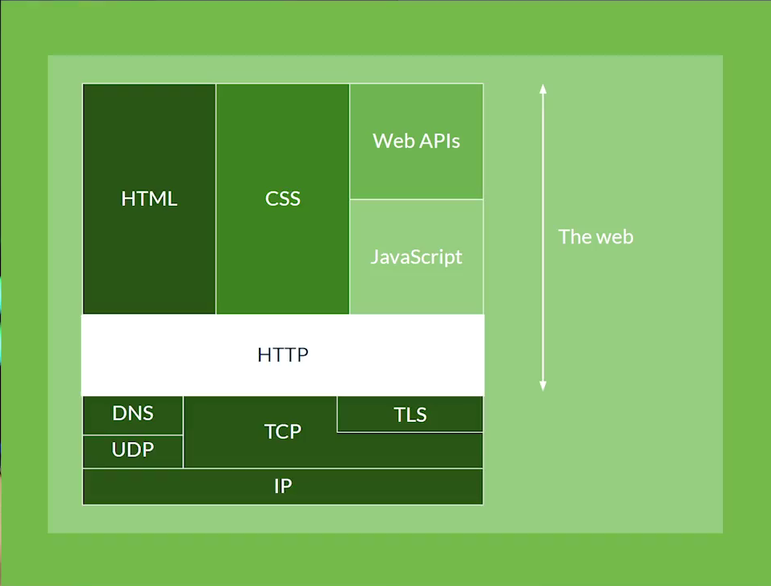
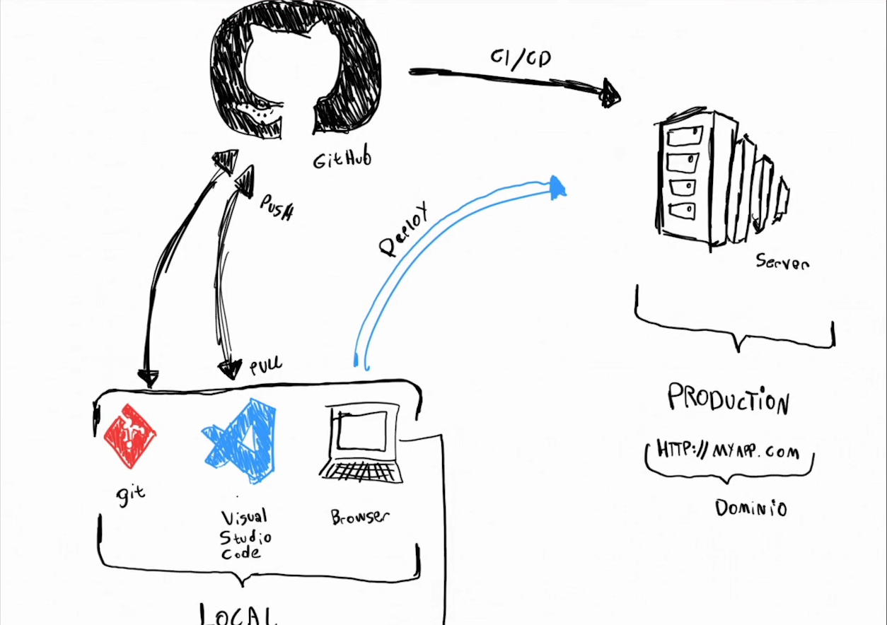

# Curso introducción al desarrollo backend

Valoración: ⭐⭐⭐⭐⭐
Estado: Terminado
Fecha de inicio: January 24, 2022 3:46 PM
Fecha de termino: January 25, 2022 1:09 PM
Página: Platzi
Última modificación: January 25, 2022 1:11 PM

# 1. Introducción

## 1.1 Todo lo que aprenderás sobre el desarrollo backend.

En este curso vamos a ver la diferencia que hay entre framework y libreria, protocolos y/o conjunto de reglas que existe entre un cliente y un servidor.

Además vamos a saber que es un servidor y que tipo de servidor existen para nuestras app. API y JSON.

Al final del curso, vamos a desarrollar una API.

# 2. Fundamentos del desarrollo web.

## 2.1. Yin y Yang de una aplicación: frontend y backend.

Pongamos un ejemplo, tenemos un auto que está compuesto por sus diferentes atributos que lo hacen ser un auto, como por ejemplo: un motor, caja de cambio, motor de partida, asientos, la carroseria, etc. Las aplicaciones web son como un auto, tienen una parte vicible (cliente - frontend) y otra oculta para solo los que saben ocuparla (servidor - backend).

### Frontend.

El frontend es la parte vicible como lo habiamos mencionado, este ocupa tecnologias para poder contruirse, acá algunas que se ocupan:

- HTML.
- CSS.
- Javascript.


> Cabe mencionar que antes de ocupar cualquier tecnologia se tiene que hacer un diseño y una experiencia de usuario UI/UX, existen algunos software que nos pueden ayudar, **Adobe, Sketch y Figma**.
> 

Cada unos de estos lenguajes (menos HTML) tiene sus derivados, que librerias o framework’s. Por ejemplo CSS tiene por framwork **fundation, Boostrap y Tailwind.**

Así mismo Javascript tambien tiene framework’s con los que se pueden trabajar, estos son **React.js, Angular, Svelte y Vue**. 

### Backend.

El backend es la parte no visible, en donde se ejecutan procesos en segundo plano, se realizan CRUD a la base de datos,etc. El backend puede ser construido por los siguientes lenguajes de programación (pueden existir más):

- Javascript: node.js como su framwork/libreria.
- PHP: Laravel, como su framework/libreria más ocupada.
- Java: Spring.
- Go
- Rust.
- Ruby: RoR (ruby on rairs)
- Python: Fast Api, Flask y Django.

## 2.2. Framework v/s libreria.

Volvemos al ejemplo del auto, pensemos en la fabricación del auto por nosotros mismos ¿por donde empezamos?, ¿por el motor?, sigamos la analogia anterior y comencemos por el backend.

Como mencionamos, comencemos por el motor, el motro lleva un sin fin de artefactos y componentes, pistones, bujias, engranajes, etc. pero como queremos empezar desde 0 (en programación el termino seria reinventar la rueda) nos ponemos en contacto con una seria de empresas que ya realizan este trabajo y lo van a ser en un menor tiempo que nosotros que queriamos comenzar desde 0, a esto en programación le denominamos **libreria** en donde ya existe un código creado que nosotros vamos a poder utilizar.

Mandamos a crear nuestro motor de auto, pero nos llega un motor de avión y ¿Que pasó? no le definimos las reglas de producción para que fuera un motor de auto. En programación una **Framework** es un conjunto de librerias, reglas y estandares para crear un producto digital.

## 2.3. ¿Cómo se conecta el frontend con el backend?: API y JSON.

Para hacer la conexión entre el frontend y el backend podemos ocupar una API (Aplication Programming interface) 

Una API es solo una sección del backend para que el frontend puede comunicarse con él a través de mensajes bidireccionales (ida y vuelta). Tenemos dos grandes estándares para crear las API’s:

- **SOAP**: (Simple Object Access Protocolo) Mueve la información a través de un lenguaje similar al HTML, es demarcado. **SOAP** es una tecnología de legado.
- **REST**: (Representational State Transfer) Utiliza otro lenguaje JSON (Javascript Object Notation). Un JSON no es más que un diccionario de Python.

## 2.4. El lenguaje que habla internet: HTTP.

El lenguaje que habla internet es HTTP (Hypertext Transfer Protocol). El cliente y el servidor son dos estamentos que siempre se están comunicando, el cliente le solicita al servidor y este responde, por ejemplo desde nuestro telefono (cliente) solicitamos en nuestro navegador ingresar a la página [htts://google.cl](https://google.cl), el servidor capta esta peticíon y devuelve una respuesta.

Las peticiones y respuesta del cliente al servidor, se conocen como **Request** y **Response** dentro de HTTP.

¿Como se vé estas peticiones y respuestas entre el cliente y el servidor?

```jsx
// Request
GET / HTTP/1.1
Host: developer.mozilla.org
Accept-Language: fr

// Response
HTTP/1.1. 200 OK
Date: Sat. 09 Oct 2010 14:20:34 GMT
Server: Apache
Last-Modified: Tue. 01 Dec 2009 20:10:22 GMT
Etag: "HASH"
Accept-Ranges: bytes
Content-length: 29769
Content-type: text/html

<!DOCTYPE html ... (here comes the 29769 bytes of the request web page)
```

El **Request** se puede traducir de la siguiente manera:

- Con el metodo **GET** (de obtener, existen otros metodos) vaya al **HOST** “development.mozilla.org” y espero que la respuesta venga en frances (**Accept-languages**)y ademas vas a utlizar la versión 1.1 de **HTTP**
- **HOST** y **Accept-languages** son cabeceras o **HEADER’S**

Cuando el servidor capte esta **Request** va a hacer un **Responde** de un body o de un JSON según sea el caso, esta respuesta que se puede traducir de la siguiente manera, según el código anterior:

- Petición aceptada (200 status code) para la versión 1.1 de **HTTP.**
- Ademas de resopnder con los siguientes header:
    - **Date**: La fecha en la cual se hizo la petición.
    - **Server**: Es el aplicativo que permite distribuir esta respuesta.
    - **Last-modified**: Indicando cuando fue la última vez que el contenido de esta respuesta fue modificado.
    - **Etag**: Conjunto de letras y números que nos permiten ver temas como por ejemplo el caché.
    - **Accept-Ranges**: Como estamos entregando la información al cliente, en este caso en byte.
    - **Content-Length**: El peso de la página en byte.
    - **Content-Type**: El formato del body de esta respuesta **HTTP**

### Escala jerarquica de los protocolos HTTP

- **IP**: internet protocolo, dirección particular a nuestra computadora.
- **TCP**: Transmision Control Protocol, sirven para transmitir datos a través de la IP
- **UDP**: User Data Protocol, sirven para transmitir datos a través de la IP
- **TLS**: Transport Layer Security, sirve para que los datos enviados por TCP y UDP viajen de manera segura.
- **DNS**: Domain Name Sistem, sirve para convertir una dirección IP´en un dominio.
- **HTTP**: HyperText Transfer Protocol, permite la comunicación entre cliente y servidor con todos los protocolos que hemos visto.
- **HTML**, **CSS**, **Javascript** y **Web API’s**



### METODOS HTTP.

Los metodos HTTP son los siguientes:

- **GET**: El método **GET** solicita una representación de un recurso especifico. Las peticiones que usan el método GET sólo deben recuperar datos.
- **HEAD**: El método **HEAD** pide una respuesta idéntica a la de una petición **GET**, pero sin el cuerpo de la respuesta, osea solo las cabeceras.
- **POST**: El método **POST** se utiliza para enviar una entidad a un recurso en especifico, causando a menudo un cambio de estado o efectos secundarios en el servidor.
- **PUT**: El método **PUT** reemplaza todas las representaciones actuales del recurso de destino con la carga útil de la petición.
- **DELETE**: El método **DELETE** borra un recurso en especifico.
- **CONNECT**: El método **CONNECT** establece un túnel hjacia el servidor identificado por el recurso.
- **OPTIONS**: El método **OPTIONS** es utilizado para descrubir las opciones de comunicación para el recurso de destino.
- **TRACE**: El método **TRACE** realiza una prueba de bucle de retorno de mensaje a lo largo de la ruta la recurso de destino.
- **PATCH**: El método **PATCH** es utilizado para aplicar modificaciones parciales a un recurso.

### STATUS CODE.

Los status code que devuelve un **Response** son los siguientes:

- Respuestas informativas.
    - **100 Continue**: Esta respuesta provisional indica que todo hasta ahora está bien y que el cliente debe continuar con las solicitud o ignorarla si ya está terminada.
    - **101 Switching Protocol**: Este código se envía en respuesta a un encabezado de solicitud [Upgrade (en-US)](https://developer.mozilla.org/en-US/docs/Web/HTTP/Headers/Upgrade) por el cliente e indica que el servidor acepta el cambio de protocolo propuesto por el agente de usuario
    - **102 Processing**: Este código indica que el servidor ha recibido la solicitud y aún se encuentra procesandola, por lo que no hay respuesta disponible.
    - **103 Early Hints**: Este código de estado está pensado principalmente para ser usado con el encabezado `[Link](https://developer.mozilla.org/es/docs/Web/HTTP/Headers/Link)`, permitiendo que el agente de usuario empiece a [pre-cargar](https://developer.mozilla.org/en-US/docs/Web/HTML/Link_types/preload) recursos mientras el servidor prepara una respuesta
- Respuestas satisfactorias:
    - **200 OK**: La solicitud ha tenido éxito. El significado de un éxito varía dependiendo del método HTTP.
    - **201 Created**: La solicitud ha tenido éxito y se ha creado un nuevo recurso como resultado de ello. Ésta es típicamente la respuesta enviada después de una petición PUT.
    - **202 Accepted**: La solicitud se ha recibido, pero aún no se ha actuado. Es una petición "sin compromiso", lo que significa que no hay manera en HTTP que permite enviar una respuesta asíncrona que indique el resultado del procesamiento de la solicitud. Está pensado para los casos en que otro proceso o servidor maneja la solicitud, o para el procesamiento por lotes.
    - **203 Non-Authoritative Information**: La petición se ha completado con éxito, pero su contenido no se ha obtenido de la fuente originalmente solicitada, sino que se recoge de una copia local o de un tercero. Excepto esta condición, se debe preferir una respuesta de 200 OK en lugar de esta respuesta.
    - **204 No Content**: La petición se ha completado con éxito pero su respuesta no tiene ningún contenido, aunque los encabezados pueden ser útiles. El agente de usuario puede actualizar sus encabezados en caché para este recurso con los nuevos valores.
    - **205 Reset Content**: La petición se ha completado con éxito, pero su respuesta no tiene contenidos y además, el agente de usuario tiene que inicializar la página desde la que se realizó la petición, este código es útil por ejemplo para páginas con formularios cuyo contenido debe borrarse después de que el usuario lo envíe.
    - **206 Partial Content**: La petición servirá parcialmente el contenido solicitado. Esta característica es utilizada por herramientas de descarga como wget para continuar la transferencia de descargas anteriormente interrumpidas, o para dividir una descarga y procesar las partes simultáneamente.
    - **207 Multi-Status**: Una respuesta Multi-Estado transmite información sobre varios recursos en situaciones en las que varios códigos de estado podrían ser apropiados. El cuerpo de la petición es un mensaje XML.
    - **208 Multi-Status**: El listado de elementos DAV ya se notificó previamente, por lo que no se van a volver a listar.
    - 209 IM Used: El servidor ha cumplido una petición `GET` para el recurso y la respuesta es una representación del resultado de una o más manipulaciones de instancia aplicadas a la instancia actual.
- **Redirecciones**:
    - **300 Multiple Choice**: Esta solicitud tiene más de una posible respuesta. User-Agent o el usuario debe escoger uno de ellos. No hay forma estandarizada de seleccionar una de las respuestas.
    - **301 Moved Permanently**: Este código de respuesta significa que la URI del recurso solicitado ha sido cambiado. Probablemente una nueva URI sea devuelta en la respuesta.
    - **302 Found**: Este código de respuesta significa que el recurso de la URI solicitada ha sido cambiado temporalmente. Nuevos cambios en la URI serán agregados en el futuro. Por lo tanto, la misma URI debe ser usada por el cliente en futuras solicitudes.
    - **303 See Other**: El servidor envía esta respuesta para dirigir al cliente a un nuevo recurso solicitado a otra dirección usando una petición GET.
    - **304 Not Modified**: Esta es usada para propósitos de "caché". Le indica al cliente que la respuesta no ha sido modificada. Entonces, el cliente puede continuar usando la misma versión almacenada en su caché.
    - **307 Temporary Redirect**: El servidor envía esta respuesta para dirigir al cliente a obtener el recurso solicitado a otra URI con el mismo método que se usó la petición anterior. Tiene la misma semántica que el código de respuesta HTTP `302 Found`, con la excepción de que el agente usuario *no debe* cambiar el método HTTP usado: si un `POST` fue usado en la primera petición, otro `POST` debe ser usado en la segunda petición.
    - **308 Perrmanent Redirect**: Significa que el recurso ahora se encuentra permanentemente en otra URI, especificada por la respuesta de encabezado HTTP `Location:`. Tiene la misma semántica que el código de respuesta HTTP `301 Moved Permanently`, con la excepción de que el agente usuario *no debe* cambiar el método HTTP usado: si un `POST` fue usado en la primera petición, otro `POST` debe ser usado en la segunda petición.
- **Errores del cliente**:
    - 400 Bad Request: Esta respuesta significa que el servidor no pudo interpretar la solicitud dada una sintaxis inválida.
    - **401 Unauthorized** Es necesario autenticar para obtener la respuesta solicitada. Esta es similar a 403, pero en este caso, la autenticación es posible.
    - **402 Payment Required:** Este código de respuesta está reservado para futuros usos. El objetivo inicial de crear este código fue para ser utilizado en sistemas digitales de pagos. Sin embargo, no está siendo usado actualmente.
    - **403 Forbidden:** El cliente no posee los permisos necesarios para cierto contenido, por lo que el servidor está rechazando otorgar una respuesta apropiada.
    - **404 Not Found:** El servidor no pudo encontrar el contenido solicitado. Este código de respuesta es uno de los más famosos dada su alta ocurrencia en la web.
    - **405 Method Not Allowed:** El método solicitado es conocido por el servidor pero ha sido deshabilitado y no puede ser utilizado. Los dos métodos obligatorios, `GET` y `HEAD`, nunca deben ser deshabilitados y no deberían retornar este código de error.
    - **406 Not Acceptable:** Esta respuesta es enviada cuando el servidor, después de aplicar una [negociación de contenido servidor-impulsado](https://developer.mozilla.org/en-US/docs/Web/HTTP/Content_negotiation#server-driven_negotiation), no encuentra ningún contenido seguido por la criteria dada por el usuario.
    - **407 Proxy Authentication Required:** Esto es similar al código 401, pero la autenticación debe estar hecha a partir de un proxy.
    - **408 Request Timeout:** Esta respuesta es enviada en una conexión inactiva en algunos servidores, incluso sin alguna petición previa por el cliente. Significa que el servidor quiere desconectar esta conexión sin usar. Esta respuesta es muy usada desde algunos navegadores, como Chrome, Firefox 27+, o IE9, usa mecanismos de pre-conexión HTTP para acelerar la navegación. También hay que tener en cuenta que algunos servidores simplemente desconecta la conexión sin enviar este mensaje.
    - **409 Conflict:** Esta respuesta puede ser enviada cuando una petición tiene conflicto con el estado actual del servidor.
    - **410 Gone:** Esta respuesta puede ser enviada cuando el contenido solicitado ha sido borrado del servidor.
    - **411 Length Required:** El servidor rechaza la petición porque el campo de encabezado `Content-Length` no esta definido y el servidor lo requiere.
    - **412 Precondition Failed:** El cliente ha indicado pre-condiciones en sus encabezados la cual el servidor no cumple.
    - **413 Payload Too Large:** La entidad de petición es más larga que los límites definidos por el servidor; el servidor puede cerrar la conexión o retornar un campo de encabezado `Retry-After`.
    - **414 URI Too Long:** La URI solicitada por el cliente es más larga de lo que el servidor está dispuesto a interpretar.
    - **415 Unsupported Media Type:** El formato multimedia de los datos solicitados no está soportado por el servidor, por lo cual el servidor rechaza la solicitud.
    - **416 Requested Range Not Satisfiable:** El rango especificado por el campo de encabezado `Range` en la solicitud no cumple; es posible que el rango está fuera del tamaño de los datos objetivo del URI.
    - **417 Expectation Failed:** Significa que la expectativa indicada por el campo de encabezado `Expect` solicitada no puede ser cumplida por el servidor.
    - **418 I'm a teapot:** El servidor se rehúsa a intentar hacer café con una tetera.
    - **421 Misdirected Request:** La petición fue dirigida a un servidor que no es capaz de producir una respuesta. Esto puede ser enviado por un servidor que no está configurado para producir respuestas por la combinación del esquema y la autoridad que están incluidos en la URI solicitada
    - **422 Unprocessable Entity:** La petición estaba bien formada pero no se pudo seguir debido a errores de semántica.
    - **423 Locked:** El recurso que está siendo accedido está bloqueado.
    - **424 Failed Dependency:** La petición falló debido a una falla de una petición previa.
    - **426 Upgrade Required:** El servidor se rehúsa a aplicar la solicitud usando el protocolo actual pero puede estar dispuesto a hacerlo después que el cliente se actualice a un protocolo diferente. El servidor envía un encabezado Upgrade en una respuesta para indicar los protocolos requeridos.
    - **428 Precondition Required:** El servidor origen requiere que la solicitud sea condicional. Tiene la intención de prevenir problemas de 'actualización perdida', donde un cliente OBTIENE un estado del recurso, lo modifica, y lo PONE devuelta al servidor, cuando mientras un tercero ha modificado el estado del servidor, llevando a un conflicto.
    - **429 Too Many Requests:** El usuario ha enviado demasiadas solicitudes en un periodo de tiempo dado.
    - **431 Request Header Fields Too Large:** El servidor no está dispuesto a procesar la solicitud porque los campos de encabezado son demasiado largos. La solicitud PUEDE volver a subirse después de reducir el tamaño de los campos de encabezado solicitados.
    - **451 Unavailable For Legal Reasons:** El usuario solicita un recurso ilegal, como alguna página web censurada por algún gobierno.
- **Errores del servidor.**
    - **500 Internal Server Error:** El servidor ha encontrado una situación que no sabe cómo manejarla.
    - **501 Not Implemented:** El método solicitado no está soportado por el servidor y no puede ser manejado. Los únicos métodos que los servidores requieren soporte (y por lo tanto no deben retornar este código) son `GET` y `HEAD`.
    - **502 Bad Gateway:** Esta respuesta de error significa que el servidor, mientras trabaja como una puerta de enlace para obtener una respuesta necesaria para manejar la petición, obtuvo una respuesta inválida.
    - **503 Service Unavailable:** El servidor no está listo para manejar la petición. Causas comunes puede ser que el servidor está caído por mantenimiento o está sobrecargado. Hay que tomar en cuenta que junto con esta respuesta, una página usuario-amigable explicando el problema debe ser enviada. Estas respuestas deben ser usadas para condiciones temporales y el encabezado HTTP `Retry-After:` debería, si es posible, contener el tiempo estimado antes de la recuperación del servicio. El webmaster debe también cuidar los encabezados relacionados al caché que son enviados junto a esta respuesta, ya que estas respuestas de condición temporal deben usualmente no estar en el caché.
    - **504 Gateway Timeout:** Esta respuesta de error es dada cuando el servidor está actuando como una puerta de enlace y no puede obtener una respuesta a tiempo.
    - **505 HTTP Version Not Supported:** La versión de HTTP usada en la petición no está soportada por el servidor.
    - **506 Variant Also Negotiates:** El servidor tiene un error de configuración interna: negociación de contenido transparente para la petición resulta en una referencia circular.
    - **507 Insufficient Storage:** El servidor tiene un error de configuración interna: la variable de recurso escogida está configurada para acoplar la negociación de contenido transparente misma, y no es por lo tanto un punto final adecuado para el proceso de negociación.
    - **508 Loop Detected:** El servidor detectó un ciclo infinito mientras procesaba la solicitud.
    - **510 Not Extended:** Extensiones adicionales para la solicitud son requeridas para que el servidor las cumpla.
    - **511 Network Authentication Required:** El código de estado 511 indica que el cliente necesita autenticar para ganar acceso a la red.

## 2.5.¿Cómo es el flujo de desarrollo de una aplicación web?

El flujo de una aplicación web es simple, veamoslo paso a paso:

- Tenemos nuestros entorno local (generalment con la ip **127.0.0.1** y el puerto **8000**), en donde nosotros tenemos instalados los programas necesario para el desarrollo de nuestra app de forma local, git, un editor de código, un navegador, etc.
- Cuando ya tenemos listo nuestro coódigo tenemos que hacer **Deploy** al servidor, pero no lo hacemos de forma directa (es una mala practica, pero se puede hacer), lo hacemos enviandolo a la nuva de nuestro git, en este caso de github. Github es una página en donde tu puedes versionar tu código y guardarlo en la página, se puede puece hacer pull y push, commit etc., es gratuito y los repositorios se pueden privatizar.
- Luego de tener el código en github, tenemos que hacer un **CI / CD (Continue Integration & Continue Deploy)** hacia nuestro servidor, este proceso es ideal para que la página no tenga errores.
- Ya estando en el servidor nuestro coódigo podemos decir que estamos en **Produccíon o Productions** y ya podemos ver reflejado nuestro trabajo en el dominio comprado.



Si deseamos comprar un dominio podemos ir a [https://www.namecheap.com](https://www.namecheap.com/)

## 2.6. El hogar de código: el servidor

El servidor, hosting o nube, es en donde nuestro código va a vivir para poder desplegarse en un dominio. Existen diferentes formas de guardar aplicaciones web y por eso vamos a ver 3 conceptos fundamentales:

- **IaaS (Infratestructura como servicio)**: Es el tipo de servicio que nos permite indicarle al provdedor del servidor las especificaciones que requerimos en nuestro proyecto (RAM, SSD, CPU). Las más populares de este tipo son: AWS, Azure y Digital Ocean
- **PaaS (Plataforma como servicio)**: Es el tipo de servicio que nos permite indicarle al provdedor del servidor que se encargue de realizar todas las actualizaciones que requerimos en nuestra app. Solo nos permite elegir que cosas particulares requere nuestro proyecto a nivel general a través de una interfaz. Las más populares de este tipo son: Firebase, Heroku y Google App Engine
- **SaaS (Software como servicio)**: Esta opción nos permite utilizar una aplicación de un proveedor para hacer funcionar nuestro proyecto. Las más populares de este tipo son: Slack, Wordpress y Google Docs

# 3. Diseño de una API.

## 3.1. Proyecto: Diseño y bosquejo de una API.

Para construir una API vamos a necesitar un framwork que nos ayude a crear nuestro proyecto de manera rapida, escalable y con buenas practicas de código, existen muchos que nos pueden ayudar pero acá te voy a mostrar solo algunos:

- Laravel
- Django
- Fast api
- Flask
- Node.js

Ya teniendo nuestro framework listo, procedemos a crear nuestra API, esta tiene que conteneder las acciones principales **Crear**, **Leer**, **Actualizar** y **Eliminar**, estas acciones van a estar asociadas a una dirección de nuestra API que se van a llamar **ENDPOINT**, los endpoint’s son nombre de URL que nosotros mismos creamos, como por ejemplo:

```jsx
'https://miapp.com/API/crear-registro'
```

“Crear-registro” es mi endpoint, y API es solo un nombre que se da por buenas practicas.

## 3.2. Proyecto: Diseñando los endpoint’s

Como lo mencionamos anteriormente los endpoint’s son URL que ejecutan alguna acción, estas acciones son crear, leer, actualizar y eliminar que en ingles sera Create, Read, Update y Delete (CRUD).

```json
{
"url" : "https://miapp.com/API/",
"GET" : "https://miapp.com/API/recursos", // obtener todos los recursos,
"POST" : "https://miapp.com/API/recurso", // crea un recurso
"POST": "https://miapp.com/API/recurso/{id_recurso}/update", // ACTUALIZA UN RECURSO EN ESPECIFICO
"DELETE": "https://miapp.com/API/recurso/{id_recurso}/delete" // ELIMINA UN RECURSO EN ESPECIFICO. 
}
```

# 4. Conclusiones.

## 4.1. ¿Qué lenguaje y framework escoger para backend?

Existen muchos lenguajes que nos pueden ayudar a crear nuestras API, va a depender de cada proyecto el lenguaje y framework que vamos a utilizar. Acá te muestro algunos:

- **Python**:
    - Django.
    - Flask.
    - Fast API.
- **Javascript**:
    - Express.
    - Nest.
- **PHP**:
    - Laravel.
    - Symfony.
- **Java**:
    - Spring.
- **Go**:
    - Gin.
    - BEEGO.
- **Ruby**:
    - Rails

# FIN