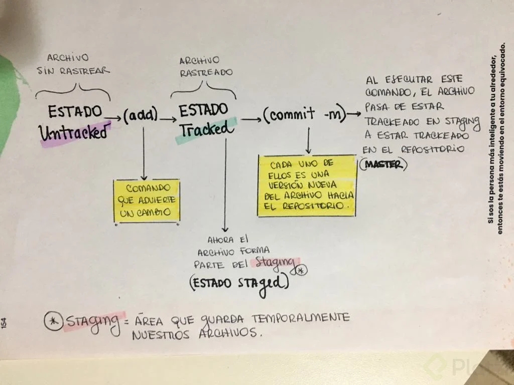
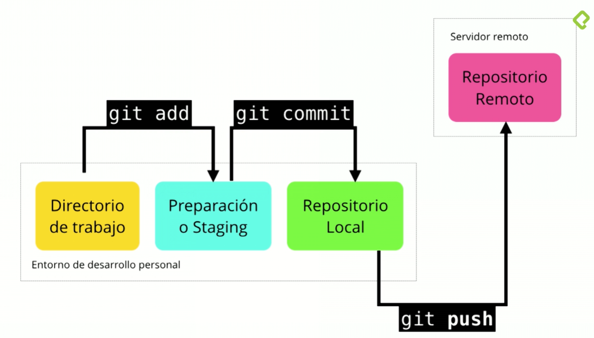
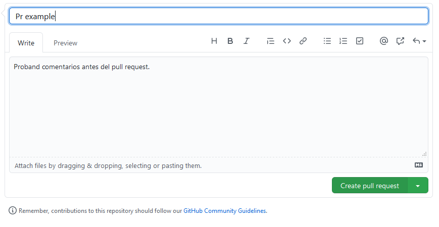
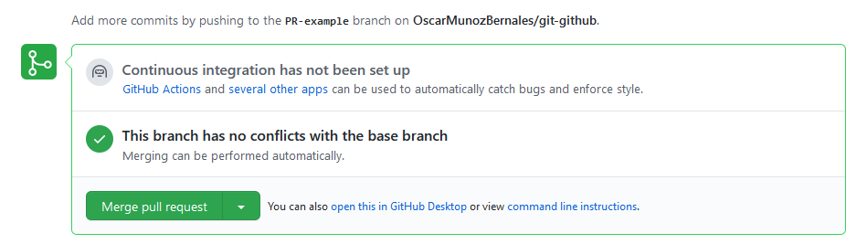

# Git y Github


Curso de git y github

# 1. Introduccón a Git

## 1.1. ¿Qué es git?
Git es un software de control de versiones diseñado por Linus Torvalds, pensando en la eficiencia y la confiabilidad del mantenimiento de versiones de aplicaciones cuando estas tienen un gran número de archivos de código fuente. En su lugar GitHub es una forja para alojar proyectos utilizando el sistema de control de versiones Git. GitHub sería la red social de código para los programadores, tu propio curriculum vitae.

## 1.2. ¿Por qué usar un sistema de control de versiones como Git?
Un sistema de control de versiones como Git nos ayuda a guardar el historial de cambios y crecimiento de los archivos de nuestro proyecto.

En realidad, los cambios y diferencias entre las versiones de nuestros proyectos pueden tener similitudes, algunas veces los cambios pueden ser solo una palabra o una parte específica de un archivo específico. Git está optimizado para guardar todos estos cambios de forma atómica e incremental, o sea, aplicando cambios sobre los últimos cambios, estos sobre los cambios anteriores y así hasta el inicio de nuestro proyecto.

- El comando para iniciar nuestro repositorio, o sea, indicarle a Git que queremos usar su sistema de control de versiones en nuestro proyecto, es **_git init_**.
- El comando para que nuestro repositorio sepa de la existencia de un archivo o sus últimos cambios es **_git add_**. Este comando no almacena las actualizaciones de forma definitiva, solo las guarda en algo que conocemos como **“Staging Area”** (no te preocupes, lo entenderemos más adelante).
- El comando para almacenar definitivamente todos los cambios que por ahora viven en el **staging area** es **_git commit_**. También podemos guardar un mensaje para recordar muy bien qué cambios hicimos en este commit con el argumento **_-m "Mensaje del commit"_**.
- Por último, si queremos mandar nuestros commits a un servidor remoto, un lugar donde todos podamos conectar nuestros proyectos, usamos el comando **_git push_**.

## 1.3. Editores de código, archivos binarios y de texto plano
Un editor de código es una herramienta que nos brinda muchas ayudas para escribir código, algo así como un bloc de notas muy avanzado. Los editores más populares son VSCode, Sublime Text y Atom, pero no necesariamente debes usar alguno de estos para continuar con el curso.

Tipos de archivos y sus diferencias:

- **Archivos de Texto (.txt)**: Texto plano normal y sin nada especial. Lo vemos igual sin importar dónde lo abramos, ya sea con el **bloc de notas** o con **editores de texto avanzados**.
- **Archivos RTF (.rtf)**: Podemos guardar texto con diferentes tamaños, estilos y colores. Pero si lo abrimos desde un editor de código, vamos a ver que es mucho más complejo que solo el texto plano. Esto es porque debe guardar todos los estilos del texto y, para esto, usa un código especial un poco difícil de entender y muy diferente a los textos con estilos especiales al que estamos acostumbrados.
- **Archivos de Word (.docx)**: Podemos guardar imágenes y texto con diferentes tamaños, estilos o colores. Al abrirlo desde un editor de código podemos ver que es código binario, muy difícil de entender y muy diferente al texto al que estamos acostumbrados. Esto es porque Word está optimizado para entender este código especial y representarlo gráficamente.
Recuerda que debes habilitar la opción de ver la extensión de los archivos, de lo contrario, solo podrás ver su nombre. La forma de hacerlo en Windows es 
> Vista > Mostrar u ocultar > Extensiones de nombre de archivo.

## 1.4. Introducción a la terminal y línea de comandos
Diferencias entre la estructura de archivos de Windows, Mac o Linux.

- La ruta principal en Windows es C:\, en UNIX es solo /.
- Windows no hace diferencia entre mayúsculas y minúsculas pero UNIX sí.

Recuerda que GitBash usa la ruta **/c** para dirigirse a **C:\ (o /d para dirigirse a D:\\) en Windows**. Por lo tanto, la ruta del usuario con el que estás trabajando es /c/Users/Nombre de tu usuario

### Comandos básicos en la terminal:

- **pwd**: Nos muestra la ruta de carpetas en la que te encuentras ahora mismo.
- **mkdir**: Nos permite crear carpetas (por ejemplo, mkdir Carpeta-Importante).
- **touch**: Nos permite crear archivos (por ejemplo, touch archivo.txt).
- **rm**: Nos permite borrar un archivo o carpeta (por ejemplo, rm archivo.txt). Mucho cuidado con este comando, puedes borrar todo tu disco duro.
- **cat**: Ver el contenido de un archivo (por ejemplo, cat nombre-archivo.txt).
- **ls**: Nos permite cambiar ver los archivos de la carpeta donde estamos ahora mismo. Podemos usar uno o más argumentos para ver más información sobre estos archivos (los argumentos pueden ser -- + el nombre del argumento o - + una sola letra o shortcut por cada argumento).
    - **ls -a**: Mostrar todos los archivos, incluso los ocultos.
    - **ls -l**: Ver todos los archivos como una lista.
- **cd**: Nos permite navegar entre carpetas.
    - **cd /**: Ir a la ruta principal:
    - **cd o cd ~**: Ir a la ruta de tu usuario
    - **cd carpeta/subcarpeta**: Navegar a una ruta dentro de la carpeta donde estamos ahora mismo.
    - **cd .. (cd + dos puntos)**: Regresar una carpeta hacia atrás.
    - Si quieres referirte al directorio en el que te encuentras ahora mismo puedes usar **cd . (cd + un punto)**.
- **history**: Ver los últimos comandos que ejecutamos y un número especial con el que podemos repetir su ejecución.
- **! + número**: Ejecutar algún comando con el número que nos muestra el comando history (por ejemplo, !72).
- **clear**: Para limpiar la terminal. También podemos usar los atajos de teclado Ctrl + L o Command + L.

Todos estos comandos tiene una función de autocompletado, o sea, puedes escribir la primera parte y presionar la tecla Tab para que la terminal nos muestre todas las posibles carpetas o comandos que podemos ejecutar. Si presionas la tecla Arriba puedes ver el último comando que ejecutamos.

Recuerda que podemos descubrir todos los argumentos de un comando con el argumento --help (por ejemplo, cat --help).

# 2. Comandos básicos en Git

## 2.1. ¿Qué es el staging y los repositorios? Ciclo básico de trabajo en Git


Para iniciar un repositorio, o sea, activar el sistema de control de versiones de Git en tu proyecto, solo debes ejecutar el comando **_git init_**.

Este comando se encargará de dos cosas: 
1. primero, crear una carpeta .git, donde se guardará toda la base de datos con cambios atómicos de nuestro proyecto
2. segundo, crear un área que conocemos como **_Staging_**, que guardará temporalmente nuestros archivos (cuando ejecutemos un comando especial para eso) y nos permitirá, más adelante, guardar estos cambios en el repositorio (también con un comando especial).

### Ciclo de vida o estados de los archivos en Git:

Cuando trabajamos con Git nuestros archivos pueden vivir y moverse entre 4 diferentes estados (cuando trabajamos con repositorios remotos pueden ser más estados, pero lo estudiaremos más adelante):

- **Archivos Tracked**: son los archivos que viven dentro de Git, no tienen cambios pendientes y sus últimas actualizaciones han sido guardadas en el repositorio gracias a los comandos **_git add_** y **_git commit_**.
- **Archivos Staged**: son archivos en Staging. Viven dentro de Git y hay registro de ellos porque han sido afectados por el comando **_git add_**, aunque no sus últimos cambios. Git ya sabe de la existencia de estos últimos cambios, pero todavía no han sido guardados definitivamente en el repositorio porque falta ejecutar el comando **_git commit_**.
- **Archivos Unstaged**: entiéndelos como archivos “Tracked pero Unstaged”. Son archivos que viven dentro de Git pero no han sido afectados por el comando git add ni mucho menos por git commit. Git tiene un registro de estos archivos, pero está desactualizado, **sus últimas versiones solo están guardadas en el disco _duro_**.
- **Archivos Untracked**: son archivos que NO viven dentro de Git, **solo en el disco duro**. Nunca han sido afectados por **_git add_**, así que Git no tiene registros de su existencia.

Recuerda que hay un caso muy raro donde los archivos tienen dos estados al mismo tiempo: staged y untracked. Esto pasa cuando guardas los cambios de un archivo en el área de Staging (con el comando git add), pero antes de hacer commit para guardar los cambios en el repositorio haces nuevos cambios que todavía no han sido guardados en el área de Staging (en realidad, todo sigue funcionando igual pero es un poco divertido).

### Comandos para mover archivos entre los estados de Git:

- **git add**: nos ayuda a mover archivos del Untracked o Unstaged al estado Staged. Podemos usar git **nombre-del-archivo-o-carpeta** para añadir archivos y carpetas individuales o **_git add -A_** para mover todos los archivos de nuestro proyecto (tanto Untrackeds como unstageds).
- **git reset HEAD**: nos ayuda a sacar archivos del estado Staged para devolverlos a su estado anterior. Si los archivos venían de Unstaged, vuelven allí. Y lo mismo se venían de Untracked.
- **git commit**: nos ayuda a mover archivos de Unstaged a Tracked. Esta es una ocasión especial, los archivos han sido guardado o actualizados en el repositorio. Git nos pedirá que dejemos un mensaje para recordar los cambios que hicimos y podemos usar el argumento **-m** para escribirlo **_(git commit -m "mensaje")_**.
- **git rm**: este comando necesita alguno de los siguientes argumentos para poder ejecutarse correctamente:
    - **git rm --cached**: Mueve los archivos que le indiquemos al estado Untracked.
    - **git rm --force**: Elimina los archivos de Git y del disco duro. Git guarda el registro de la existencia de los archivos, por lo que podremos recuperarlos si es necesario (pero debemos usar comandos más avanzados).

## 2.2. ¿Qué es un Branch (rama) y cómo funciona un Merge en Git?
Git es una base de datos muy precisa con todos los cambios y crecimiento que ha tenido nuestro proyecto. Los commits son la única forma de tener un registro de los cambios. Pero las ramas amplifican mucho más el potencial de Git.

Todos los commits se aplican sobre una **rama**. Por defecto, siempre empezamos en la **rama master** _(pero puedes cambiarle el nombre si no te gusta)_ y creamos nuevas ramas, a partir de esta, para crear flujos de trabajo independientes.

Crear una nueva rama se trata de copiar un commit (de cualquier rama), pasarlo a otro lado (a otra rama) y continuar el trabajo de una parte específica de nuestro proyecto sin afectar el flujo de trabajo principal (que continúa en la rama master o la rama principal).

Los equipos de desarrollo tienen un estándar: Todo lo que esté en la rama master va a producción, las nuevas features, características y experimentos van en una rama **_“development”_** (para unirse a master cuando estén definitivamente listas) y los issues o errores se solucionan en una rama **_“hotfix”** para unirse a master tan pronto como sea posible.

Crear una nueva rama lo conocemos como Checkout. Unir dos ramas lo conocemos como Merge.

Podemos crear todas las ramas y commits que queramos. De hecho, podemos aprovechar el registro de cambios de Git para crear ramas, traer versiones viejas del código, arreglarlas y combinarlas de nuevo para mejorar el proyecto.

Solo ten en cuenta que combinar estas ramas (sí, hacer “merge”) puede generar conflictos. Algunos archivos pueden ser diferentes en ambas ramas. Git es muy inteligente y puede intentar unir estos cambios automáticamente, pero no siempre funciona. En algunos casos, somos nosotros los que debemos resolver estos conflictos “a mano”.

## 2.3. Crea un repositorio de Git y haz tu primer commit
Si quieres ver los archivos ocultos de una carpeta puedes habilitar la opción de Vista > Mostrar u ocultar > Elementos ocultos (en Windows) o ejecutar el comando **_ls -a_**.

Le indicaremos a Git que queremos crear un nuevo repositorio para utilizar su sistema de control de versiones. Solo debemos posicionarnos en la carpeta raíz de nuestro proyecto y ejecutar el comando git init.

Recuerda que al ejecutar este comando (y de aquí en adelante) vamos a tener una nueva carpeta oculta llamada .git con toda la base de datos con cambios atómicos en nuestro proyecto.

Recuerda que Git está optimizado para trabajar en equipo, por lo tanto, debemos darle un poco de información sobre nosotros. No debemos hacerlo todas las veces que ejecutamos un comando, basta con ejecutar solo una sola vez los siguientes comandos con tu información:
```
> git config --global user.email "tu@correo.com"
> git config --global user.name "tu nombre"
```

Existen muchas otras configuraciones de Git que puedes encontrar ejecutando el comando 

```
# Muestra la configuración de git
> git config --list 

# Muestra la configuración de git y ademas en donde estan guardadas.
> git config --list --show-origin
```

## 2.4. Analizar cambios en los archivos de tu proyecto con GIT
```
# El comando show nos muestra los cambios que han existido sobre un archivo.
> git show

# Si queremos ver la diferencia entre una version y otra
> git diff commitA commitB

# Obetener los ID de tus commits
> git log

# Obtiene los ID de tus commit y ademas el detalle de los cambios
> git log --stat

```

## 2.5. Volver en el tiempo en nuestro repositorio utilizando reset y checkout
El comando **_git checkout + ID del commit_** nos permite viajar en el tiempo. Podemos volver a cualquier versión anterior de un archivo específico o incluso del proyecto entero. Esta también es la forma de crear ramas y movernos entre ellas.

También hay una forma de hacerlo un poco más “ruda”: usando el comando **git reset**. En este caso, no solo “volvemos en el tiempo”, sino que borramos los cambios que hicimos después de este commit.

Hay dos formas de usar git reset: con el argumento **--hard**, borrando toda la información que tengamos en el área de staging (y perdiendo todo para siempre). O, un poco más seguro, con el argumento **--soft**, que mantiene allí los archivos del área de staging para que podamos aplicar nuestros últimos cambios pero desde un commit anterior.

## 2.6. Git reset vs Git rm
Git reset y git rm son comandos con utilidades muy diferentes, pero aún así se confunden muy fácilmente.

### Git rm
Este comando nos ayuda a eliminar archivos de Git sin eliminar su historial del sistema de versiones. Esto quiere decir que si necesitamos recuperar el archivo solo debemos “viajar en el tiempo” y recuperar el último commit antes de borrar el archivo en cuestión.

Recuerda que git rm no puede usarse así nomás. Debemos usar uno de los flags para indicarle a Git cómo eliminar los archivos que ya no necesitamos en la última versión del proyecto:

```
# Elimina los archivos del área de Staging y del próximo commit pero los mantiene en nuestro disco duro.

> git rm --cached

# Elimina los archivos de Git y del disco duro. Git siempre guarda todo, por lo que podemos acceder al registro de la existencia de los archivos, de modo que podremos recuperarlos si es necesario (pero debemos usar comandos más avanzados).

> git rm --force
```

### Git reset
Este comando nos ayuda a volver en el tiempo. Pero no como git checkout que nos deja ir, mirar, pasear y volver. Con git reset volvemos al pasado sin la posibilidad de volver al futuro. Borramos la historia y la debemos sobreescribir. No hay vuelta atrás.

Este comando es muy **peligroso** y debemos usarlo solo en caso de emergencia. Recuerda que debemos usar alguna de estas dos opciones:

Hay dos formas de usar git reset: con el argumento --hard, borrando toda la información que tengamos en el área de staging (y perdiendo todo para siempre). O, un poco más seguro, con el argumento --soft, que mantiene allí los archivos del área de staging para que podamos aplicar nuestros últimos cambios pero desde un commit anterior.

```
# Borramos todo el historial y los registros de Git pero guardamos los cambios que tengamos en Staging, así podemos aplicar las últimas actualizaciones a un nuevo commit.
> git reset [hash] --soft

# Borra todo. Todo todito, absolutamente todo. Toda la información de los commits y del área de staging se borra del historial.
> git reset [hash] --hard
```

**¡Pero todavía falta algo!**

```
# Este es el comando para sacar archivos del área de Staging. No para borrarlos ni nada de eso, solo para que los últimos cambios de estos archivos no se envíen al último a menos que cambiemos de opinión y los incluyamos de nuevo en staging con git add, por supuesto.
> git reset HEAD 
```

¿Por qué esto es importante?
Imagina el siguiente caso:

Hacemos cambios en los archivos de un proyecto para una nueva actualización. Todos los archivos con cambios se mueven al área de staging con el comando git add. Pero te das cuenta de que uno de esos archivos no está listo todavía. Actualizaste el archivo pero ese cambio no debe ir en el próximo commit por ahora.

¿Qué podemos hacer?

Bueno, todos los cambios están en el área de Staging, incluido el archivo con los cambios que no están listos. Esto significa que debemos sacar ese archivo de Staging para poder hacer commit de todos los demás.

¡Al usar git rm lo que haremos será eliminar este archivo completamente de git! Todavía tendremos el historial de cambios de este archivo, con la eliminación del archivo como su última actualización. Recuerda que en este caso no buscábamos eliminar un archivo, solo dejarlo como estaba y actualizarlo después, no en este commit.

En cambio, si usamos git reset HEAD, lo único que haremos será mover estos cambios de Staging a Unstaged. Seguiremos teniendo los últimos cambios del archivo, el repositorio mantendrá el archivo (no con sus últimos cambios pero sí con los últimos en los que hicimos commit) y no habremos perdido nada.

Conclusión: Lo mejor que puedes hacer para salvar tu puesto y evitar un incendio en tu trabajo es conocer muy bien la diferencia y los riesgos de todos los comandos de Git.

# 3. Flujo de trabajo básico en GIT

## 3.1. Flujo de trabajo básico con un repositorio remoto

Por ahora, nuestro proyecto vive únicamente en nuestra computadora. Esto significa que no hay forma de que otros miembros del equipo trabajen en él.

Para solucionar esto están los servidores remotos: un nuevo estado que deben seguir nuestros archivos para conectarse y trabajar con equipos de cualquier parte del mundo.

Estos servidores remotos pueden estar alojados en **GitHub, GitLab, BitBucket, entre otros**. Lo que van a hacer es guardar el mismo repositorio que tienes en tu computadora y darnos una URL con la que todos podremos acceder a los archivos del proyecto para descargarlos, hacer cambios y volverlos a enviar al servidor remoto para que otras personas vean los cambios, comparen sus versiones y creen nuevas propuestas para el proyecto.



Esto significa que debes aprender algunos nuevos comandos:

- **git clone url_del_servidor_remoto**: Nos permite descargar los archivos de la última versión de la rama principal y todo el historial de cambios en la carpeta .git.
- **git push**: Luego de hacer git add y git commit debemos ejecutar este comando para mandar los cambios al servidor remoto.
- **git fetch**: Lo usamos para traer actualizaciones del servidor remoto y guardarlas en nuestro repositorio local (en caso de que hayan, por supuesto).
- **git merge**: También usamos el comando git merge con servidores remotos. Lo necesitamos para combinar los últimos cambios del servidor remoto y nuestro directorio de trabajo.
- **git pull**: Básicamente, git fetch y git merge al mismo tiempo.

## 3.2. Introducción a las ramas o branches de git

Las ramas son la forma de hacer cambios en nuestro proyecto sin afectar el flujo de trabajo de la rama principal. Esto porque queremos trabajar una parte muy específica de la aplicación o simplemente experimentar.

La cabecera o HEAD representan la rama y el commit de esa rama donde estamos trabajando. Por defecto, esta cabecera aparecerá en el último commit de nuestra rama principal. Pero podemos cambiarlo al crear una rama (**git branch NOMBRE_RAMA**, **git checkout -b NOMBRE_RAMA**) o movernos en el tiempo a cualquier otro commit de cualquier otra rama con los comandos (**git reset id-commit**, **git checkout rama-o-id-commit**).

## 3.3. Fusión de ramas con git merge

El comando git merge nos permite crear un nuevo commit con la combinación de dos ramas (la rama donde nos encontramos cuando ejecutamos el comando y la rama que indiquemos después del comando).

```
# Crear un nuevo commit en la rama master combinando
# los cambios de la rama cabecera:
> git checkout master
> git merge cabecera

# Crear un nuevo commit en la rama cabecera combinando
# los cambios de cualquier otra rama:
> git checkout cabecera
> git merge cualquier-otra-rama
```

Es como si Git tuviera super poderes para saber qué cambios queremos conservar de una rama y qué otros de la otra. El problema es que no siempre puede adivinar, sobretodo en algunos casos donde dos ramas tienen actualizaciones diferentes en ciertas líneas en los archivos. Esto lo conocemos como un conflicto y aprenderemos a solucionarlos en la siguiente clase.

Recuerda que al ejecutar el comando **git checkout** para cambiar de rama o commit puedes perder el trabajo que no hayas guardado. **_Guarda tus cambios antes de hacer git checkout_**.

## 3.4. Resolución de conflictos.

**Git nunca borra nada a menos que nosotros se lo indiquemos**. Cuando usamos los comandos git merge o git checkout estamos cambiando de rama o creando un nuevo commit, no borrando ramas ni commits **(recuerda que puedes borrar commits con git reset y ramas con git branch -d)**.

Git es muy inteligente y puede resolver algunos conflictos automáticamente: cambios, nuevas líneas, entre otros. Pero algunas veces no sabe cómo resolver estas diferencias, por ejemplo, cuando dos ramas diferentes hacen cambios distintos a una misma línea.

Esto lo conocemos como conflicto y lo podemos resolver manualmente, solo debemos hacer el merge, ir a nuestro editor de código y elegir si queremos quedarnos con alguna de estas dos versiones o algo diferente. Algunos editores de código como VSCode nos ayudan a resolver estos conflictos sin necesidad de borrar o escribir líneas de texto, basta con hundir un botón y guardar el archivo.

Recuerda que siempre debemos crear un nuevo commit para aplicar los cambios del merge. Si Git puede resolver el conflicto hará commit automáticamente. Pero, en caso de no pueda resolverlo, debemos solucionarlo y hacer el commit.

Los archivos con conflictos por el comando git merge entran en un nuevo estado que conocemos como Unmerged. Funcionan muy parecido a los archivos en estado Unstaged, algo así como un estado intermedio entre Untracked y Unstaged, solo debemos ejecutar git add para pasarlos al área de staging y git commit para aplicar los cambios en el repositorio.

PROBANDO ERRORES RAMA PROBANDO ERRORES

# 4. Trabajando con repositorios remotos en github

## 4.1. Uso de Github

GitHub es una plataforma que nos permite guardar repositorios de Git que podemos usar como servidores remotos y ejecutar algunos comandos de forma visual e interactiva (sin necesidad de la consola de comandos).

Luego de crear nuestra cuenta, podemos crear o importar repositorios, crear organizaciones y proyectos de trabajo, descubrir repositorios de otras personas, contribuir a esos proyectos, dar estrellas y muchas otras cosas.

El README.md es el archivo que veremos por defecto al entrar a un repositorio. Es una muy buena práctica configurarlo para describir el proyecto, los requerimientos y las instrucciones que debemos seguir para contribuir correctamente.

Para clonar un repositorio desde GitHub (o cualquier otro servidor remoto) debemos copiar la URL (por ahora, usando HTTPS) y ejecutar el comando git clone + la URL que acabamos de copiar. Esto descargara la versión de nuestro proyecto que se encuentra en GitHub.

Sin embargo, esto solo funciona para las personas que quieren empezar a contribuir en el proyecto. Si queremos conectar el repositorio de GitHub con nuestro repositorio local, el que creamos con git init, debemos ejecutar las siguientes instrucciones:

```
# Primero: Guardar la URL del repositorio de GitHub
# con el nombre de origin
git remote add origin URL

# Segundo: Verificar que la URL se haya guardado
# correctamente:
git remote
git remote -v

# Tercero: Traer la versión del repositorio remoto y
# hacer merge para crear un commit con los archivos
# de ambas partes. Podemos usar git fetch y git merge
# o solo el git pull con el flag --allow-unrelated-histories:
git pull origin master --allow-unrelated-histories

# Por último, ahora sí podemos hacer git push para guardar
# los cambios de nuestro repositorio local en GitHub:
git push origin master

```

## 4.2. Cómo funcionan las llaves públicas y privadas
Las llaves públicas y privadas nos ayudan a cifrar y descifrar nuestros archivos de forma que los podamos compartir sin correr el riesgo de que sean interceptados por personas con malas intenciones.

La forma de hacerlo es la siguiente:
- Ambas personas deben crear su llave pública y privada.
- Ambas personas pueden compartir su llave pública a las otras partes (recuerda que esta llave es pública, no hay problema si la “interceptan”).
- La persona que quiere compartir un mensaje puede usar la llave pública de la otra persona para cifrar los archivos y asegurarse que solo puedan ser descifrados con la llave privada de la persona con la que queremos compartir el mensaje.
- El mensaje está cifrado y puede ser enviado a la otra persona sin problemas en caso de que los archivos sean interceptados.
- La persona a la que enviamos el mensaje cifrado puede usar su llave privada para descifrar el mensaje y ver los archivos.

Puedes compartir tu llave pública pero nunca tu llave privada.

En la siguiente clase vamos a crear nuestras llaves para compartir archivos con GitHub sin correr el riesgo de que sean interceptados.

## 4.3. Configura tus llaves SSH en local

Primer paso: Generar tus llaves SSH. Recuerda que es muy buena idea proteger tu llave privada con una contraseña.

```
> ssh-keygen -t rsa -b 4096 -C "tu@email.com"
```

Segundo paso: Terminar de configurar nuestro sistema.

En Windows y Linux:
```
# Encender el "servidor" de llaves SSH de tu computadora:
> eval $(ssh-agent -s)

# Añadir tu llave SSH a este "servidor":
> ssh-add ruta-donde-guardaste-tu-llave-privada
```

En Mac:

```
# Encender el "servidor" de llaves SSH de tu computadora:
> eval "$(ssh-agent -s)"

# Si usas una versión de OSX superior a Mac Sierra (v10.12)
# debes crear o modificar un archivo "config" en la carpeta
# de tu usuario con el siguiente contenido (ten cuidado con
# las mayúsculas):
Host *
        AddKeysToAgent yes
        UseKeychain yes
        IdentityFile ruta-donde-guardaste-tu-llave-privada

# Añadir tu llave SSH al "servidor" de llaves SSH de tu
# computadora (en caso de error puedes ejecutar este
# mismo comando pero sin el argumento -K):
> ssh-add -K ruta-donde-guardaste-tu-llave-privada
```

## 4.4. Conexión a GitHub con SSH

Luego de crear nuestras llaves SSH podemos entregarle la llave pública a GitHub para comunicarnos de forma segura y sin necesidad de escribir nuestro usuario y contraseña todo el tiempo.

Para esto debes entrar a la Configuración de Llaves SSH en GitHub, crear una nueva llave con el nombre que le quieras dar y el contenido de la llave pública de tu computadora.

Ahora podemos actualizar la URL que guardamos en nuestro repositorio remoto, solo que, en vez de guardar la URL con HTTPS, vamos a usar la URL con SSH:

```
> git remote set-url origin url-ssh-del-repositorio-en-github
```


## 4.5. Tags y versiones en Git y GitHub

Los tags o etiquetas nos permiten asignar versiones (release) a los commits con cambios más importantes o significativos de nuestro proyecto .

Comandos para trabajar con etiquetas:
- Crear un nuevo tag y asignarlo a un commit: **git tag -a nombre-del-tag id-del-commit**.
- Borrar un tag en el repositorio local: **git tag -d nombre-del-tag**.
- Listar los tags de nuestro repositorio local: **git tag o git show-ref --tags**.
- Publicar un tag en el repositorio remoto: **git push origin --tags**.
- Borrar un tag del repositorio remoto: **git tag -d nombre-del-tag y git push origin :refs/tags/nombre-del-tag**.

## 4.6. Manejo de ramas en GitHub

Puedes trabajar con ramas que nunca envías a GitHub, así como pueden haber ramas importantes en GitHub que nunca usas en el repositorio local. Lo importante es que aprendas a manejarlas para trabajar profesionalmente.

- Crear una rama en el repositorio local: **git branch nombre-de-la-rama** o **git checkout -b nombre-de-la-rama**.
- Publicar una rama local al repositorio remoto: **git push origin nombre-de-la-rama**.

Recuerda que podemos ver gráficamente nuestro entorno y flujo de trabajo local con Git usando el comando gitk.

## 4.7. Configurar múltiples colaboradores en un repositorio de GitHub

Por defecto, cualquier persona puede clonar o descargar tu proyecto desde GitHub, pero no pueden crear commits, ni ramas, ni nada.

Existen varias formas de solucionar esto para poder aceptar contribuciones. Una de ellas es añadir a cada persona de nuestro equipo como colaborador de nuestro repositorio.

Solo debemos entrar a la configuración de colaboradores de nuestro proyecto (Repositorio > Settings > Collaborators) y añadir el email o username de los nuevos colaboradores.

## 5. Flujo de trabajos profesionales.

## 5.1. Flujo de trabajo profesional con pull request.
En un entorno profesional normalmente se bloquea la rama master, y para enviar código a dicha rama pasa por un **code review** y luego de su aprobación se unen códigos con los llamados **merge request**.

Para realizar pruebas enviamos el código a servidores que normalmente los llamamos **staging develop** (servidores de pruebas) luego de que se realizan las pruebas pertinentes tanto de código como de la aplicación estos pasan a el servidor de producción con el ya antes mencionado **merge request**.

- github: **pull request**
- gitlab: **merge request**
- bitbucket: **push request**


## 5.2. Utilizando pull request en github
### Pull request

Es una funcionalidad de github (en gitlab llamada merge request y en bitbucket push request), en la que un colaborador pide que revisen sus cambios antes de hacer merge a una rama, normalmente master.

Al hacer un pull request se genera una conversación que pueden seguir los demás usuarios del repositorio, así como autorizar y rechazar los cambios.

El flujo del pull request es el siguiente
- Se trabaja en una rama paralela los cambios que se desean (git checkout -b <rama>)
- Se hace un commit a la rama (git commit -am '<Comentario>')
- Se suben al remoto los cambios (git push origin <rama>)
- En GitHub se hace el pull request comparando la rama master con la rama del fix. <br> 
- Uno, o varios colaboradores revisan que el código sea correcto y dan feedback (en el chat del pull request) <br> 
- El colaborador hace los cambios que desea en la rama y lo vuelve a subir al remoto (automáticamente jala la historia de los cambios que se hagan en la rama, en remoto)
- Se aceptan los cambios en GitHub <br> 
- Se hace merge a master desde GitHub

<span style="color: red; font-size: 15px">Importante<span>: Cuando se modifica una rama, también se modifica el pull request.


## 5.3. Forks o Bifurcaciones

Es una característica única de GitHub en la que se crea una copia exacta del estado actual de un repositorio directamente en GitHub, éste repositorio podrá servir como otro origen y se podrá clonar (como cualquier otro repositorio), en pocas palabras, lo podremos utilizar como un git cualquiera.
Un fork es como una bifurcación del repositorio completo, tiene una historia en común, pero de repente se bifurca y pueden variar los cambios, ya que ambos proyectos podrán ser modificados en paralelo y para estar al día un colaborador tendrá que estar actualizando su fork con la información del original..
Al hacer un fork de un poryecto en GitHub, te conviertes en dueñ@ del repositorio fork, puedes trabajar en éste con todos los permisos, pero es un repositorio completamente diferente que el original, teniendo alguna historia en común.
Los forks son importantes porque es la manera en la que funciona el open source, ya que, una persona puede no ser colaborador de un proyecto, pero puede contribuír al mismo, haciendo mejor software que pueda ser utilizado por cualquiera.
Al hacer un fork, GitHub sabe que se hizo el fork del proyecto, por lo que se le permite al colaborador hacer pull request desde su repositorio propio.

### Trabajando con más de 1 repositorio remoto

Cuando trabajas en un proyecto que existe en diferentes repositorios remotos (normalmente a causa de un fork) es muy probable que desees poder trabajar con ambos repositorios, para ésto puedes crear un remoto adicional desde consola.
```

> git remote add <nombre_del_remoto> <url_del_remoto> 
> git remote upstream https://github.com/freddier/hyperblog

# Al crear un remoto adicional podremos, hacer pull desde el nuevo origen (en caso de tener permisos podremos hacer fetch y push)

> git pull <remoto> <rama>
> git pull upstream master

# Éste pull nos traerá los cambios del remoto, por lo que se estará al día en el proyecto, el flujo de trabajo cambia, en adelante se estará trabajando haciendo pull desde el upstream y push al origin para pasar a hacer pull request.

> git pull upstream master
> git push origin master

```

# 6. Multiples entornos de trabajo en GIT

## 6.1. Rebase
El comando rebase es una <span style="color: red; font-size: 20px;">MALA PRÁCTICA</span>, nunca se debe usar, pero para efectos del curso te lo vamos a enseñar para que hagas tus propios experimentos. Con rebase puedes recoger todos los cambios confirmados en una rama y ponerlos sobre otra.

```
# Cambiamos a la rama que queremos traer los cambios
> git checkout experiment

# Aplicamos rebase para traer los cambios de la rama que queremos 
> git rebase master
```

## 6.2. Git Stash: Guardar cambios en memoria y recuperarlos después

### Stashed:

El stashed nos sirve para guardar cambios para después, Es una lista de estados que nos guarda algunos cambios que hicimos en Staging para poder cambiar de rama sin perder el trabajo que todavía no guardamos en un commit

Ésto es especialmente útil porque hay veces que no se permite cambiar de rama, ésto porque porque tenemos cambios sin guardar, no siempre es un cambio lo suficientemente bueno como para hacer un commit, pero no queremos perder ese código en el que estuvimos trabajando.

El stashed nos permite cambiar de ramas, hacer cambios, trabajar en otras cosas y, más adelante, retomar el trabajo con los archivos que teníamos en Staging pero que podemos recuperar ya que los guardamos en el Stash.

### GIT  STASH

El comando git stash guarda el trabajo actual del Staging en una lista diseñada para ser temporal llamada Stash, para que pueda ser recuperado en el futuro.

Para agregar los cambios al stash se utiliza el comando:
```
git stash
```

Podemos poner un mensaje en el stash, para asi diferenciarlos en git stash list por si tenemos varios elementos en el stash. Ésto con:
```
git stash save "mensaje identificador del elemento del stashed"
```

### Obtener elelmentos del stash

El stashed se comporta como una Stack de datos comportándose de manera tipo LIFO (del inglés Last In, First Out, «último en entrar, primero en salir»), así podemos acceder al método pop.

El método pop recuperará y sacará de la lista el último estado del stashed y lo insertará en el staging area, por lo que es importante saber en qué branch te encuentras para poder recuperarlo, ya que el stash será agnóstico a la rama o estado en el que te encuentres, siempre recuperará los cambios que hiciste en el lugar que lo llamas.

Para recuperar los últimos cambios desde el stash a tu staging area utiliza el comando:
```
git stash pop
```

Para aplicar los cambios de un stash específico y eliminarlo del stash:
```
git stash pop stash@{<num_stash>}
```

Para retomar los cambios de una posición específica del Stash puedes utilizar el comando:
```
git stash apply stash@{<num_stash>}
```

Donde el <num_stash> lo obtienes desden el git stash list

### Listado de elementos en el stash

Para ver la lista de cambios guardados en Stash y así poder recuperarlos o hacer algo con ellos podemos utilizar el comando:
```
git stash list
```

Retomar los cambios de una posición específica del Stash || Aplica los cambios de un stash específico

### Crear una rama con el stash

Para crear una rama y aplicar el stash mas reciente podemos utilizar el comando
```
git stash branch <nombre_de_la_rama>
```

Si deseas crear una rama y aplicar un stash específico (obtenido desde git stash list) puedes utilizar el comando:
```
git stash branch nombre_de_rama stash@{<num_stash>}
```

Al utilizar estos comandos crearás una rama con el nombre <nombre_de_la_rama>, te pasarás a ella y tendrás el stash especificado en tu staging area.

### Eliminar elementos del stash

Para eliminar los cambios más recientes dentro del stash (el elemento 0), podemos utilizar el comando:
```
git stash drop
```

Pero si en cambio conoces el índice del stash que quieres borrar (mediante git stash list) puedes utilizar el comando:
```
git stash drop stash@{<num_stash>}
```

Donde el <num_stash> es el índice del cambio guardado.

Si en cambio deseas eliminar todos los elementos del stash, puedes utilizar:
```
git stash clear
```

Consideraciones:
- El cambio más reciente (al crear un stash) SIEMPRE recibe el valor 0 y los que estaban antes aumentan su valor.
- Al crear un stash tomará los archivos que han sido modificados y eliminados. Para que tome un archivo creado es necesario agregarlo al Staging Area con git add [nombre_archivo] con la intención de que git tenga un seguimiento de ese archivo, o también utilizando el comando git stash -u (que guardará en el stash los archivos que no estén en el staging).
- Al aplicar un stash este no se elimina, es buena práctica eliminarlo.

## 6.3. Git Clean: limpiar tu proyecto de archivos no deseados

A veces creamos archivos cuando estamos realizando nuestro proyecto que realmente no forman parte de nuestro directorio de trabajo, que no se deberían agregar y lo sabemos.

- Para saber qué archivos vamos a borrar tecleamos **git clean --dry-run**
- Para borrar todos los archivos listados (que no son carpetas) tecleamos **git clean -f**

## 6.4. Git cherry-pick: traer commits viejos al head de un branch

Existe un mundo alternativo en el cual vamos avanzando en una rama pero necesitamos en master uno de esos avances de la rama, para eso utilizamos el comando **git cherry-pick IDCommit**.

cherry-pick es una <span style="color: red; font-size:20px;">MALA PRÁCTICA</span> porque significa que estamos reconstruyendo la historia, usa cherry-pick con sabiduría. Si no sabes lo que estás haciendo ten mucho cuidado.

# 7. Comandos de git para casos de emergencia.

## 7.1. Reconstruir commits en Git con amend

A veces hacemos un commit, pero resulta que no queríamos mandarlo porque faltaba algo más. Utilizamos **git commit --amend**, amend en inglés es remendar y lo que hará es que los cambios que hicimos nos los agregará al commit anterior.

## 7.2. Git reset y reflog: úseses en caso de emergencia.

### Git nunca olvida, git reflog

Git guarda todos los cambios aunque decidas borrarlos, al borrar un cambio lo que estás haciendo sólo es actualizar la punta del branch, para gestionar éstas puntas existe un mecanismo llamado **registros de referencia o reflogs**.
La gestión de estos cambios es mediante los hash’es de referencia (o ref) que son apuntadores a los commits.
Los recoges registran cuándo se actualizaron las referencias de Git en el repositorio local (sólo en el local), por lo que si deseas ver cómo has modificado la historia puedes utilizar el comando:
```
git reflog
```

Muchos comandos de Git aceptan un parámetro para especificar una referencia o “ref”, que es un puntero a una confirmación sobre todo los comandos:
- git checkout Puedes moverte sin realizar ningún cambio al commit exacto de la ref
```
> git checkout eff544f
```

- git reset: Hará que el último commit sea el pasado por la ref, usar este comando sólo si sabes exactamente qué estás haciendo
```
> git reset --hard eff544f 
# Perderá todo lo que se encuentra en staging y en el Working directory y se moverá el head al commit eff544f

> git reset --soft eff544f 
# Te recuperará todos los cambios que tengas diferentes al commit eff544f, los agregará al staging area y moverá el head al commit eff544f
```

- git merge: Puedes hacer merge de un commit en específico, funciona igual que con una branch, pero te hace el merge del estado específico del commit mandado
```
> git checkout master
> git merge eff544f 
# Fusionará en un nuevo commit la historia de master con el momento específico en el que vive eff544f
```


## 7.3. Buscar en archivos y commits de Git con Grep y log
A medida que nuestro proyecto se hace grande vamos a querer buscar ciertas cosas.

Por ejemplo: ¿cuántas veces en nuestro proyecto utilizamos la palabra color?

Para buscar utilizamos el comando git grep color y nos buscará en todo el proyecto los archivos en donde está la palabra color.

- Con **git grep -n color** nos saldrá un output el cual nos dirá en qué línea está lo que estamos buscando.
- Con **git grep -c color** nos saldrá un output el cual nos dirá cuántas veces se repite esa palabra y en qué archivo.
- Si queremos buscar cuántas veces utilizamos un atributo de HTML lo hacemos con git grep -c "< p > " (sin los espacios)

Para buscar en los comentarios de los commit utilizamos:
- **git log -S "cabecera"**

# 8. Bonus

## 8.1. Comandos y recursos colaborativos en Git y GitHub

```
# muestra cuantos commit han hecho cada miembros del equipo.
> git shortlog -sn

# muestra cuantos commit han hecho cada miembros del equipo hasta los que han sido eliminado
> git shortlog -sn --all
    
# muestra cuantos commit han hecho cada miembros quitando los eliminados sin los merges
> git shortlog -sn --all --no-merge
    
# muestra quien hizo cada cosa linea por linea
>git blame ARCHIVO
    
# muestra como funciona el comando.
> git COMANDO --help

#muestra quien hizo cada cosa linea por linea indicándole desde que linea ver ejemplo -L35,50
> git blame ARCHIVO -Llinea_inicial,linea_final

# se muestran todas las ramas remotas
> git branch -r

# se muestran todas las ramas tanto locales como remotas
> git branch -a
```

